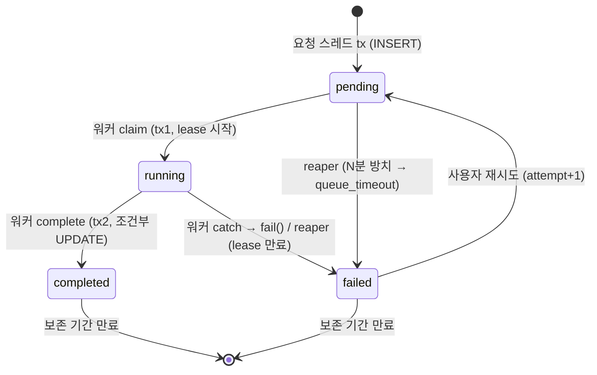
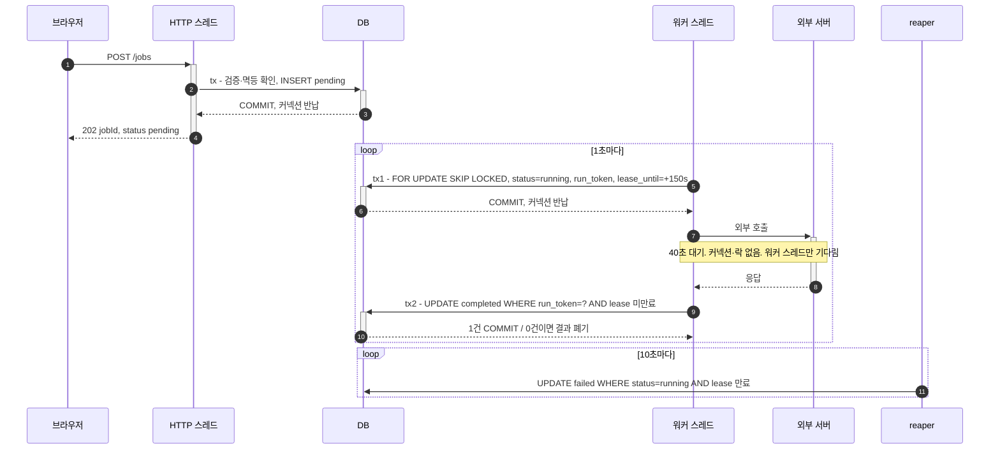

# DB를 작업 큐로 — 워커·lease·reaper·상태 기계

> **한 줄 요약**: 수십 초짜리 외부 호출을 HTTP 요청에서 떼어 내려면, 요청은 작업 행 하나(`pending`)만 넣고 즉시 응답하고, 같은 앱의 **워커**가 주기적으로 행을 **선점(claim, 짧은 tx) → 트랜잭션 밖에서 실행 → 조건부 완료(짧은 tx)** 한다. 실행 중에는 행이 잠겨 있지 않으므로, 롤백의 자리를 **lease(만료 시각) + run_token + 조건부 UPDATE + reaper(청소부)** 가 채운다. 테이블 하나가 작업 큐·상태 기계·기록을 겸한다.

관련 노트: [@Transactional §6(4) 트랜잭션 밖≠비동기](../java/spring/transactional.md) · [SELECT FOR UPDATE · SKIP LOCKED](../database/select-for-update.md) · [Read-Modify-Write(조건부 UPDATE)](../java/jpa/read-modify-write.md) · [이벤트 유실 방지(outbox)](../java/spring/event-outbox-pattern.md) · [Advisory Lock·분산락](../database/postgres-advisory-lock.md) · [스레드 풀(@Async)](../java/concurrency/thread-pool.md)

---

## 1. 언제 쓰나

- 외부 호출(AI·외부 API·파일 변환)이 수 초~수십 초라 **HTTP 요청 수명과 작업 수명을 분리**해야 할 때 — 사용자를 40초 세워 두지 않기
- 재시작·배포 뒤에도 **할 일이 남아 있어야** 하는데, MQ를 따로 운영할 규모는 아닐 때
- 반대로 초당 수백 건 이상, 여러 소비자 fan-out, 1초 지연도 길다면 MQ 쪽 (§4)

## 2. 구조 — 누가 무엇을 하나

**워커** = 같은 Spring 앱 안에서 HTTP 요청과 무관하게 타이머로 도는 메서드(`@EnableScheduling` + `@Scheduled(fixedDelay = 1000)`, 스케줄러 스레드 기본 1개). 별도 서버가 아니다. 주방 비유: 카운터 직원(HTTP 스레드)은 주문표(`pending` 행)를 꽂고 번호표(id)를 주면 **끝**, 요리사(워커)는 1초마다 꽂이(DB)를 보고 하나 집어 요리, 손님(브라우저)은 번호로 상태를 폴링(GET)한다. 카운터와 요리사는 직접 대화 없이 DB만 본다 — 그래서 요리가 40초여도 손님을 즉시 돌려보낸다.

**reaper(청소부)** = 워커와 같은 `@Scheduled` 메서드지만 일을 하지 않고 **일하다 죽은 흔적을 치운다**(이름은 Unix의 zombie reaping). "스케줄러"는 트리거(알람시계)일 뿐 역할이 아니다 — 워커(claim·외부 호출·complete)와 reaper(상태 변경만)는 같은 방식으로 깨어나 다른 일을 한다.

### 상태 기계



### 한 건의 흐름



## 3. 사용 예시 — 워커 코드

```java
// 조율 메서드 — @Transactional 없음 (붙이면 아래 ①②③이 한 트랜잭션 = 원점)
@Scheduled(fixedDelay = 1000)
public void runOnce() {
    Optional<Claim> claim = claimer.claimNext();         // ① tx: FOR UPDATE SKIP LOCKED → status='running'·run_token·lease_until 갱신 → 커밋
    if (claim.isEmpty()) return;
    try {
        Result result = externalClient.call(claim.input());  // ② tx 없음. 커넥션도 락도 없음
        completer.complete(claim.id(), claim.runToken(), result);
        // ③ tx: UPDATE ... SET status='completed' WHERE id=? AND status='running' AND run_token=? AND lease_until > now() → 0건이면 늦은 결과 폐기
    } catch (Exception e) {
        completer.fail(claim.id(), claim.runToken(), "external_timeout");  // 짧은 tx, 같은 조건부 UPDATE
    }
}
```

- `claimer`·`completer`는 **다른 빈**이다 — 같은 클래스면 자기호출이라 `@Transactional`이 무시된다([@Transactional §6(1)](../java/spring/transactional.md)).
- `FOR UPDATE SKIP LOCKED`라 워커 여러 대가 같은 행을 집지 않는다([SELECT FOR UPDATE](../database/select-for-update.md)).
- ②동안 행이 잠겨 있지 않으므로 그 사이 reaper가 만료 처리했거나 사용자가 삭제했을 수 있다. ③의 WHERE가 그 대가다 — 잠금을 "쓰기 직전 확인"으로 바꾼 것([Read-Modify-Write](../java/jpa/read-modify-write.md)).
- **"트랜잭션 밖" ≠ "기다리지 않음".** ②에서 워커 스레드는 40초 블로킹된다. 바뀐 건 그동안 손에 든 것 — 트랜잭션 안이면 스레드 1 + 커넥션 1(풀 10개 중) + 행 락, 밖이면 스레드 1만.

## 4. 비교 — 실패 정리 책임 3층 / 큐를 어디에 두나

쪼개면 **롤백은 각 조각 안에서만** 된다. ③이 예외를 던지면 ③만 롤백되고 ①은 40초 전에 커밋돼 안 돌아간다 → 행은 `running`으로 남는다. 트랜잭션 경계를 넘는 되돌리기는 없으므로 정리를 층으로 나눈다. 각 층은 앞 층이 못 하는 것을 맡는다.

| 층 | 누가 | 언제 | 남기는 것 |
|---|---|---|---|
| ① 트랜잭션 롤백 | DB 자동 | 한 묶음 안에서 예외 | 그 묶음의 변경만 되돌림 |
| ② `catch` + 보상 쓰기 | 워커 자신 | 살아 있고 실패를 인지 | 0.1초 안에 **구체적** 코드(`external_timeout`) |
| ③ reaper | 타임아웃 스케줄러 | 죽었거나(크래시·OOM·DB 장애) ②의 쓰기가 실패 | lease 만료 후 **포괄적** 코드(`lease_expired`) |

- 한 줄: **살아 있으면 catch가, 죽었으면 스케줄러가.** ②만 있으면 프로세스가 죽을 때 catch가 실행되지 않아 구멍, ③만 있으면 3초 만에 실패해도 사용자는 lease+주기(150+10초)를 더 기다리고 이유도 모른다.
- ②·③ 둘 다 `WHERE run_token=? AND status='running'` 조건부라 먼저 온 쪽 1건·나중 쪽 0건으로 충돌하지 않는다. 같은 이유로 reaper를 여러 인스턴스에서 돌려도 안전하다.
- reaper는 `pending`인데 N분 넘게 아무도 안 집은 행도 `queue_timeout`으로 닫는다.

| | DB 큐 (폴링) | `@Async` 메모리 큐 | MQ (Kafka·RabbitMQ 등) |
|---|---|---|---|
| 재시작·크래시 시 할 일 | **남음** (DB 행) | 증발 — 흔적도 없음 | 남음 |
| 상태와 업무 데이터 | 한 트랜잭션 | — | 이중 쓰기 → outbox 필요 |
| 지연 | 폴링 주기(1초) | 즉시 | 즉시(push) |
| 처리량·fan-out | 작음~중간 | 인스턴스 메모리 한도 | 큼, 여러 consumer |
| 추가 인프라 | 없음 | 없음 | 브로커 운영 |

`@Async` 메서드 안에서 외부 호출 + DB 업데이트를 하는 것 자체는 흔한 방식이지만, **할 일이 executor의 메모리 큐에 산다**. 그래서 넷을 끌고 온다. ① 재시작 시 증발 → 결국 "오래된 `pending`을 다시 집는 스케줄러"가 필요해진다(= 워커) ② 호출자가 `@Transactional`이면 커밋 전에 실행될 수 있어 다른 커넥션에서 아직 행이 안 보인다 → `@TransactionalEventListener(AFTER_COMMIT)` ③ `void @Async`의 예외는 로그만 남는다 → 안에서 `catch → fail()` ④ Boot 기본 executor는 코어 8·큐 무제한(가상 스레드면 무제한 동시) → 전용 executor로 제한(인스턴스별). ①때문에 안전망은 어차피 필요하고, 그러면 `@Async`는 **주기 지연을 없애는 빠른 길**로만 남는다 = [outbox의 하이브리드](../java/spring/event-outbox-pattern.md). 작업이 40초짜리면 1초 지연은 무의미하니 안전망(워커)만 두는 선택도 합리적이다.

## 5. ⚠️ 함정

- **워커 메서드에 `@Transactional` 한 줄** — claim·외부 호출·complete가 한 트랜잭션이 되어 40초 동안 커넥션·행 락을 쥔다. 그동안 같은 행을 지우려는 사용자는 대기하고, 워커 5개면 풀에서 커넥션 5개가 사라진다. 외부 호출이 실패해 롤백돼도 외부 쪽은 이미 40초를 썼다 — 롤백이 되돌린 건 DB 두 줄뿐. (전체 그림은 [@Transactional §6(4)](../java/spring/transactional.md)의 A~D 표)
- **작업 상한 < lease** (예: 120초 < 150초). lease는 reaper의 판단 근거이자 늦은 결과를 버리는 기준이다. 죽은 게 아니라 **느렸던** 워커가 160초에 돌아와도 `lease_until > now()`가 0건이라 `failed` 위에 `completed`를 덮어쓰지 못한다. 상한이 lease보다 길면 살아 있는 작업을 reaper가 죽인다.
- **reaper는 워커가 없는 동기 구조에도 필요하다.** 요청 스레드가 tx1 → 외부 호출 → tx2를 하는 구조(트랜잭션 밖·동기)도 외부 호출 대기 중 서버가 재시작되면 행이 `running`으로 영원히 남는다. "일을 시작시키는 스케줄러"는 없어도 "죽은 흔적을 치우는 스케줄러"는 있어야 한다.
- **Spring 이벤트(`ApplicationEvent`·`@TransactionalEventListener`·`@Async`)는 ③이 될 수 없다** — 프로세스 메모리에 살아 프로세스와 함께 죽는다. 알림·통계 같은 부가 동작에만 쓰고, 되돌리기의 근거는 항상 **DB에 남은 것**(상태·lease)에 둔다.
- **재시작 직후의 남은 lease** — 이전 프로세스가 집어 둔 행은 lease가 끝날 때까지 `running`이다. 보수적으로 가려면 재시작 시 미만료 lease가 남아 있으면 reaper가 정리할 때까지 새 claim을 멈춘다.
- **동시 실행 수는 인스턴스별이다.** 스레드도 무한하지 않으니 워커 동시 실행 수를 제한하되, 인스턴스가 늘면 전역 상한도 늘어난다. 전역 N개 제한은 [Advisory Lock](../database/postgres-advisory-lock.md)의 순서를 따른다.

## 6. 💡 판단 기준

- **규모가 작으면 MQ보다 DB 큐.** 재시작해도 할 일이 남고, 상태와 데이터가 한 트랜잭션, 재시도는 `failed → pending`으로 자연스럽고, 인프라가 0이다. 대가는 폴링 주기만큼의 지연과 주기적 조회 부하.
- **MQ로 바꿀 수 있나?** — 바꿀 수 있지만 바뀌는 건 **워커를 깨우는 알람**(1초 폴링 → push)뿐이다. 상태 행·claim/complete 분리·조건부 UPDATE(at-least-once 중복 대비)는 그대로 남고, **이중 쓰기 문제가 새로 생겨** outbox를 넣게 되며, outbox의 relay가 곧 DB를 폴링하는 스케줄러다 — 폴링은 사라지지 않고 자리만 옮긴다. 업무 행이 outbox 역할까지 겸하는 DB 큐는 그 중간층이 없는 구조다. MQ가 맞는 조건은 ① 초당 수백 건 이상 ② 같은 사건을 여러 consumer가 받는 fan-out ③ DB를 공유하지 않는 서비스 간 전달 ④ 1초 지연도 길 때. 지연만 문제면 PostgreSQL `LISTEN`/`NOTIFY`(트랜잭션이 커밋돼야 전달되어 이중 쓰기 없음)로 워커를 깨우고 폴링은 안전망으로 남기는 중간 단계가 있다. `FOR UPDATE SKIP LOCKED` 기반 DB 큐는 Solid Queue·Oban·Graphile Worker 같은 잡 큐 라이브러리가 쓰는 방식이다.
- **"할 일의 진실은 DB 행, 알람은 갈아 끼울 수 있게"** 짜 두면 전환 비용이 워커 진입점 하나에 국한된다.
- 구체 케이스: 외부 AI 호출이 40초 걸리는 작업을 "워커 메서드 하나에 `@Transactional`"(C)과 "claim·complete 분리"(D)로 비교해 보니, 막대 길이만 달라진 게 아니라 **실패를 되돌리는 주체가 바뀌었다** — C는 롤백이, D는 lease·reaper·조건부 쓰기가 한다. 코드가 늘어나는 이유가 거기에 있고, saga·outbox도 같은 원리다.

## 7. 참고

- [PostgreSQL — SELECT: The Locking Clause (SKIP LOCKED)](https://www.postgresql.org/docs/current/sql-select.html#SQL-FOR-UPDATE-SHARE)
- [PostgreSQL — NOTIFY](https://www.postgresql.org/docs/current/sql-notify.html) (트랜잭션 커밋 시 전달)
- [Spring Framework — Task Execution and Scheduling](https://docs.spring.io/spring-framework/reference/integration/scheduling.html) (스케줄러 기본 스레드 1개)
- [Spring Boot — Task Execution and Scheduling](https://docs.spring.io/spring-boot/reference/features/task-execution-and-scheduling.html) (자동 구성 executor·scheduler)
- [microservices.io — Transactional Outbox](https://microservices.io/patterns/data/transactional-outbox.html)
- 관련 노트: [@Transactional](../java/spring/transactional.md) · [SELECT FOR UPDATE](../database/select-for-update.md) · [이벤트 유실 방지](../java/spring/event-outbox-pattern.md) · [Advisory Lock](../database/postgres-advisory-lock.md) · [동적 스케줄링](../java/spring/dynamic-scheduling.md) · ["배치"의 세 층위(스케줄링≠Spring Batch)](../java/spring/batch-three-meanings.md)

---

**학습 날짜**: 2026-10-02 (@Transactional 노트 §6(4)에 쌓였던 워커·DB 큐 내용을 별도 노트로 분리)
**계기**: "외부 호출 40초짜리 작업을 트랜잭션 밖으로 빼면, 실패했을 때 누가 되돌리나?"에서 출발 — 트랜잭션 경계를 쪼개면 롤백의 자리를 무엇이 채우는지(lease·reaper·조건부 쓰기)와, DB를 큐로 쓰는 구조를 MQ와 비교해 정리.
