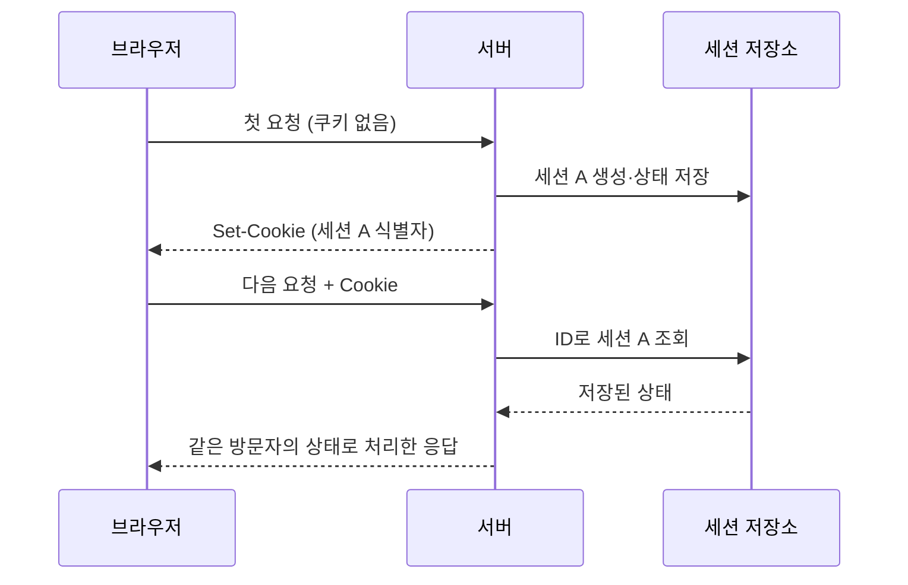

# 세션과 쿠키 — 여러 HTTP 요청을 같은 방문자의 요청으로 연결하기

> **한 줄 요약:** 세션은 여러 요청에 걸쳐 유지하는 상태이고, 쿠키는 브라우저에 작은 값을 보관하고 요청에 실어 보내는 수단이다. 서버 세션 방식에서는 쿠키에 **세션 ID**, 서버에 **세션 데이터**를 둔다.

읽는 순서: **이 노트 → [HttpSession](../../java/spring/http-session.md) → [Spring Session JDBC](../../java/spring/spring-session-jdbc.md)**

## 1. 언제 쓰나 — 왜 서버가 나를 기억해야 할까?

쇼핑몰에서 다음 요청을 보낸다고 생각해 보자.

1. 상품을 장바구니에 담는다.
2. 다른 상품 페이지를 연다.
3. 장바구니를 조회한다.

HTTP는 기본적으로 **무상태(stateless)** 프로토콜이다. 앞 요청과 뒤 요청이 같은 방문자의 것이라는 업무상 관계를 자동으로 기억해 주지 않는다. TCP 연결을 재사용하더라도 장바구니 주인을 알아서 식별하는 것은 아니다. [RFC 9110 §3.4 Messages — "HTTP is a stateless request/response protocol"](https://www.rfc-editor.org/rfc/rfc9110.html#name-messages)

애플리케이션은 요청을 연결할 식별자를 사용한다. 서버 세션 방식에서는 **세션 ID를 보내온 방문자에게 그 ID에 해당하는 상태를 연결**한다. 로그인 전 장바구니나 임시 작성 정보에도 사용할 수 있다.

### “무상태”는 서버가 아무 데이터도 저장하지 않는다는 말인가?

아니다. 서버는 회원·주문·상품을 DB에 저장할 수 있다. 무상태라는 말은 **HTTP 프로토콜 자체가 이전 요청의 업무 상태를 다음 요청에 자동 연결하지 않는다**는 뜻이다.

다음 요청만 보면 어떤 장바구니를 가져와야 하는지 알 수 없다.

```http
GET /cart HTTP/1.1
Host: shop.example
```

방문자 A도 B도 같은 주소로 요청할 수 있다. URL만으로는 구별되지 않으니 쿠키 같은 추가 식별 정보가 필요하다. IP만으로 구별하면 같은 공유기를 쓰는 여러 사람을 혼동하거나 네트워크를 바꾼 사람을 새 사용자로 취급할 수 있다.

### 보관함으로 생각해 보기

| 비유 | 웹에서 대응하는 것 |
| --- | --- |
| 보관함에 든 물건 | 서버의 세션 데이터 |
| 보관함을 찾는 표 | 세션 ID |
| 표를 들고 다니는 주머니 | 브라우저의 쿠키 저장소 |
| 표를 받아 보관함을 찾는 직원 | 서버의 세션 처리 기능 |

다음 방문에 표를 내면 직원이 같은 보관함을 찾는다. 다만 웹에서는 **ID를 아는 사람이 접근할 수 있으므로 단순 번호표보다 비밀 열쇠에 가깝다.** 그래서 예측하기 어려운 ID를 사용하고 유출을 막는다.

## 2. 실제로 주고받는 값

아래 ID는 설명용 축약값이다. 실제 ID는 프레임워크가 예측하기 어렵게 생성한다.

**첫 응답 — 서버가 쿠키를 내려준다.**

```http
HTTP/1.1 200 OK
Set-Cookie: SESSION=opaque-id-A; Path=/; HttpOnly; Secure; SameSite=Lax
```

브라우저는 `SESSION`이라는 이름과 값을 저장한다. **`Set-Cookie`는 서버 → 브라우저 방향**이다.

**다음 요청 — 브라우저가 쿠키를 돌려준다.**

```http
GET /cart HTTP/1.1
Host: shop.example
Cookie: SESSION=opaque-id-A
```

**`Cookie`는 브라우저 → 서버 방향**이다. 브라우저가 도메인·경로·보안 조건에 맞춰 전송한다. 프런트 코드가 요청마다 새 ID를 만드는 방식이 아니다. [쿠키 동작](https://developer.mozilla.org/en-US/docs/Web/HTTP/Guides/Cookies)



서버에서 세션을 만들기로 한 시점에 발급하는 것이지, 모든 사이트가 첫 방문 즉시 세션을 생성해야 하는 것은 아니다.

### 방문자가 두 명이면?

서버의 저장 상태를 이해하기 쉽게 펼치면 다음과 같다. 실제 DB 컬럼 구조를 그대로 표현한 것은 아니다.

```text
세션 A → { cartId: "cart-42", preferredLanguage: "ko" }
세션 B → { cartId: "cart-87", preferredLanguage: "en" }
```

| 요청 | 보내는 쿠키 | 서버가 찾는 상태 |
| --- | --- | --- |
| A가 장바구니 조회 | 세션 A의 ID | cart-42 |
| B가 장바구니 조회 | 세션 B의 ID | cart-87 |
| A가 페이지 새로고침 | 세션 A의 ID | 계속 cart-42 |
| A가 쿠키를 지운 뒤 조회 | 없음 | 이전 세션과 연결할 단서가 없음 |

쿠키를 지웠다고 서버의 장바구니 데이터까지 즉시 지워지는 것은 아니다. **상태가 남아 있는 것과 그 상태에 접근할 식별자를 갖고 있는 것은 다르다.** 회원 로그인 같은 별도 복구 수단이 없다면 이전 상태를 다시 연결하지 못할 수 있다.

## 3. 쿠키·세션 ID·세션 데이터 구분

| 용어 | 예시 | 위치·역할 |
| --- | --- | --- |
| 쿠키 | `SESSION=opaque-id-A` | 브라우저가 저장하고 요청에 전송 |
| 세션 ID | `opaque-id-A` | 서버의 세션을 찾는 식별자. 실제 쿠키에는 인코딩된 값이 들어갈 수도 있음 |
| 세션 데이터 | `cartId`, `preferredLanguage` | 서버 세션 저장소에 보관 |
| 세션 저장소 | 서버 메모리·DB·Redis | 세션 ID와 상태, 만료 정보 관리 |

쿠키가 모두 세션용인 것은 아니다. 테마 설정처럼 값 자체를 저장할 수도 있다. 반대로 서버 세션의 전체 데이터가 쿠키에 들어가는 것도 아니다.

### 왜 세션 데이터를 쿠키에 다 넣지 않나

| 이유 | 설명 |
| --- | --- |
| 크기 | 쿠키 하나는 약 4KB가 상한(RFC 6265 §6.1은 최소 4,096바이트 보장을 요구). 장바구니 목록을 넣기엔 작다 |
| 매 요청 전송 | 쿠키는 조건에 맞는 **모든 요청**에 붙는다. 이미지·JS 요청에도 같이 실려 대역폭을 먹는다 |
| 변조 가능 | 쿠키는 클라이언트 손에 있다. 서명 없이 `role=admin`을 넣으면 사용자가 바꿀 수 있다 |
| 노출 | 브라우저 저장소에 평문으로 남는다 |

그래서 쿠키에는 **의미 없는 난수 ID(opaque ID)**만 두고 데이터는 서버가 가진다. RFC 6265도 세션 정보를 쿠키에 직접 담지 말고 nonce(세션 식별자)만 담는 방식을 권한다. [RFC 6265 §8.4 Session Identifiers](https://www.rfc-editor.org/rfc/rfc6265.html#section-8.4)

**세션 저장소가 "서버 메모리"면 서버가 2대가 될 때 문제가 된다.** 요청이 다른 서버로 가면 그 서버 메모리에는 세션이 없다. 해법은 같은 사용자를 같은 서버로 고정(sticky session)하거나 저장소를 DB·Redis로 빼는 것 → [스케일 아웃](../scaling.md), [Spring Session JDBC](../../java/spring/spring-session-jdbc.md).

## 4. 쿠키 옵션과 두 가지 만료

| 옵션 | 의미 |
| --- | --- |
| `HttpOnly` | JavaScript(`document.cookie`)의 쿠키 읽기를 차단. 브라우저의 HTTP 전송(`fetch` 포함)은 유지 → XSS로 세션 ID를 **읽어가는** 것을 막는 용도 |
| `Secure` | HTTPS 요청에만 전송. `localhost`는 브라우저가 예외로 허용 |
| `SameSite=Lax` | 다른 사이트에서 시작된 요청의 쿠키 전송을 제한. 세 값 비교는 아래 표 |
| `Domain` | **생략하면 호스트 전용(host-only)**: 발급한 호스트에만 전송, 서브도메인 제외. `Domain=example.com`으로 주면 `*.example.com` 전체에 전송. OWASP는 세션 쿠키엔 생략을 권장(서브도메인 하나가 뚫리면 전체 세션이 노출) |
| `Path=/` | 사이트의 어떤 경로로 보낼지 지정. **생략하면 발급 요청 URL의 디렉터리가 기본값**(RFC 6265 §4.1.2.4): `/api/login` 응답에서 Path 없이 내리면 `Path=/api`가 되어 `/` 페이지 요청에는 안 실림 → "로그인은 됐는데 홈에선 로그아웃 상태". Tomcat·Spring Session의 세션 쿠키는 컨텍스트 경로(보통 `/`)를 넣어 주지만 직접 만드는 쿠키는 빠뜨리기 쉽다. 그리고 **보안 경계가 아니다** — `/foo` 응답도 `Path=/qux` 쿠키를 심을 수 있음(RFC 6265 §8.6) |
| `Max-Age=1800` | 브라우저가 보관할 기간: 1,800초. `Expires`와 둘 다 있으면 **`Max-Age`가 우선** |
| `Expires=<날짜>` | 보관 만료 절대 시각. 클라이언트 시계에 의존하므로 상대 시간인 `Max-Age`가 덜 흔들림 |

### SameSite 세 값

"사이트"는 origin이 아니라 **등록 가능한 도메인(eTLD+1) + 스킴** 기준이다. `api.example.com`과 `www.example.com`은 다른 origin이지만 **같은 사이트**다. 반대로 `http://`와 `https://`는 다른 사이트로 취급된다(schemeful same-site).

| 값 | 교차 사이트 요청에 쿠키가 실리나 | 언제 고르나 |
| --- | --- | --- |
| `Strict` | 안 실림. 다른 사이트에서 링크를 눌러 들어온 **첫 요청에도 쿠키가 없다** | CSRF 방어 최우선. "메일 링크 타고 들어왔는데 로그아웃 상태"를 감수할 수 있을 때 |
| `Lax` | **최상위 이동(주소창·링크 클릭) + 안전한 메서드(GET)**에만 실림. ``·`fetch`·교차 사이트 POST 폼에는 안 실림 | 기본 선택. Chrome은 속성이 없으면 Lax로 취급하지만(발급 2분 이내 쿠키는 POST에도 붙이는 완화 규칙 포함) 브라우저마다 달라서 **명시가 원칙** |
| `None` | 모두 실림. **`Secure` 없으면 브라우저가 거부** | 다른 사이트에 임베드되는 위젯, 프런트와 API가 다른 사이트인 경우. 브라우저의 서드파티 쿠키 정책에 추가로 걸린다 |

**브라우저가 판단하는 방법.** 요청을 보낼 때마다 "이 요청을 **시작한 페이지의 사이트**"와 "**요청이 가는 곳의 사이트**"를 비교한다. 같으면 same-site, 다르면 cross-site. 그다음 쿠키의 SameSite 값과 요청 종류를 보고 쿠키를 붙일지 정한다. 이 판단 결과는 요청 헤더 `Sec-Fetch-Site`(`same-origin`·`same-site`·`cross-site`·`none`)로 서버에서도 볼 수 있다.

요청 종류별로 보면(다른 사이트 페이지 → 우리 사이트):

| 요청 | Strict | Lax | None |
| --- | --- | --- | --- |
| 링크 클릭·주소창 이동 (최상위 GET) | 안 붙음 | **붙음** | 붙음 |
| 폼 전송으로 이동 (최상위 POST) | 안 붙음 | 안 붙음 | 붙음 |
| `fetch`·XHR | 안 붙음 | 안 붙음 | 붙음 (응답 읽기는 CORS가 따로 판단) |
| ``·`<iframe>`·`<script>` 로드 | 안 붙음 | 안 붙음 | 붙음 |
| 우리 사이트 안에서 보낸 요청 | 붙음 | 붙음 | 붙음 |

- **Lax가 링크 클릭 GET만 허용하는 이유는 사용성이다.** 검색 결과나 메일 링크로 들어왔을 때 로그인 상태가 유지되게 하려는 것. 그 대가로 **GET은 상태를 바꾸면 안 된다** — GET으로 삭제·송금을 만들면 링크 하나로 CSRF가 된다.
- **쿠키가 안 붙은 CSRF 요청은 "모르는 사람의 요청"이 된다.** 요청은 도착하지만 피해자 신분이 실리지 않는다 → [웹 공격 지도](./web-attacks-map.md) "SameSite가 카드를 안 붙이면 요청은 막히나?"
- **같은 사이트의 다른 서브도메인은 막지 못한다.** `blog.example.com`에서 `app.example.com`으로의 POST는 same-site라 Lax 쿠키가 붙는다. 서브도메인 하나가 XSS에 뚫리면 SameSite는 방어가 되지 않으므로 Origin 검사가 필요하다([Origin 헤더](./origin-header.md)).

### 쿠키 삭제는 "만료된 쿠키를 다시 내리는 것"

```http
Set-Cookie: SESSION=; Path=/; Max-Age=0
```

서버가 브라우저 저장소를 직접 지울 방법은 없다. `Max-Age=0`(또는 과거 `Expires`)을 내리면 브라우저가 **같은 이름·Domain·Path**의 쿠키를 버린다. 셋 중 하나가 원본과 다르면 별개의 쿠키로 취급되어 지워지지 않는다. 로그아웃은 보통 서버 세션 `invalidate()` + 이 삭제 쿠키를 함께 내린다. 서버만 지우면 브라우저는 죽은 ID를 계속 보내고 서버는 매번 못 찾는 상태가 된다.

`Max-Age`·`Expires`가 없는 **세션 쿠키**와 **서버 세션**은 다른 개념이다. 세션 쿠키의 종료 시점은 브라우저 정책에 따르며, 브라우저 복원 기능 때문에 종료 후 복원되기도 한다. [Set-Cookie 명세 설명](https://developer.mozilla.org/en-US/docs/Web/HTTP/Reference/Headers/Set-Cookie)

예를 들어 쿠키는 7일, 서버 세션은 비활성 30분으로 설정할 수 있다. 하루 뒤 브라우저가 쿠키를 보내도 서버 세션은 이미 만료됐을 수 있다. **쿠키가 있다는 사실만으로 유효한 방문자 상태가 보장되지 않는다.**

### "쿠키 7일"로는 로그인 유지가 안 된다 → Remember-me

위 조합에서 서버 세션이 만료된 뒤의 7일 쿠키는 **죽은 ID를 계속 보내는 쿠키**일 뿐이다. 세션 쿠키에 긴 `Max-Age`를 주면 얻는 건 "브라우저를 재시작해도 서버 세션이 살아 있는 동안은 이어진다" 하나다. "로그인 유지"는 세션 쿠키 수명을 늘려서 만드는 게 아니라, **별도의 장수 토큰 쿠키가 세션을 다시 만들어 주는** 구조다.

```text
세션 쿠키(SESSION)   : Max-Age 없음 → 브라우저 종료 시 소멸. 서버 세션 ID
remember-me 쿠키     : 2주 등 장수. "이 사람을 다시 로그인시켜도 된다"는 토큰

요청에 SESSION이 없거나 만료됨
  → remember-me 쿠키 검증 성공
  → 새 세션 생성 + 인증 정보 복원 + 새 SESSION 쿠키 발급
```

Spring Security `rememberMe()`는 두 구현을 제공한다. **해시 기반**은 `username:만료시각:서명`을 쿠키에 담아 서버 상태 없이 검증한다. 탈취되면 만료까지 어느 기기에서든 쓸 수 있고, 비밀번호 변경으로만 전체 무효화된다. **영속 토큰 기반**은 DB(`persistent_logins`)에 series·token을 저장하고 쓸 때마다 token을 교체해, 옛 token이 들어오면 탈취로 판단한다. 기본 유효기간은 2주(`tokenValiditySeconds`). [Spring Security — Remember-Me](https://docs.spring.io/spring-security/reference/servlet/authentication/rememberme.html)

💡 **세션 쿠키는 브라우저를 닫으면 사라지는 세션 쿠키로 두고(OWASP 권장), "로그인 유지"는 remember-me로 분리한다.** 두 개념을 세션 쿠키 하나의 `Max-Age`로 해결하려 들면, 서버 세션이 죽은 뒤 죽은 ID만 실어 보내는 요청이 늘어날 뿐 로그인은 유지되지 않는다.

### 시간 순서로 보는 만료

| 시각 | 사건 | 서버의 비활성 만료 기준 |
| --- | --- | --- |
| 월요일 10:00 | 세션 생성 | 이후 30분간 접근이 없으면 만료 |
| 월요일 10:20 | 해당 세션으로 요청 | 마지막 접근을 기준으로 다시 30분 |
| 월요일 10:51 | 이후 요청이 없다가 다시 접근 | 이미 비활성 기간을 넘김 |

월요일 10:51에도 7일짜리 쿠키는 남아 있을 수 있다. 하지만 서버는 기존 세션을 유효하다고 인정하지 않는다. 이때 **새 세션을 만들지, 접근을 거부할지**는 애플리케이션이 정한다. Java에서는 이 차이가 `getSession()`과 `getSession(false)` 선택으로 이어진다.

### 서버 만료 안에도 두 축이 있다: 비활성 vs 절대

| 축 | 기준 | 계속 클릭하면 | Servlet `HttpSession` |
| --- | --- | --- | --- |
| 비활성(idle) | 마지막 접근 시각 + N분 | 접근할 때마다 리셋 → 영원히 살 수 있음 | `setMaxInactiveInterval()`로 지원. 위 표가 이것 |
| 절대(absolute) | 생성 시각 + N시간 | 리셋 안 됨. 활동 중이어도 끊고 재인증 | **없다.** `getCreationTime()`을 보고 필터 등에서 직접 `invalidate()` |

OWASP는 둘을 함께 두라고 권한다. 참고 범위는 비활성이 고위험 앱 2~5분·저위험 15~30분, 절대가 하루 종일 쓰는 업무 앱이면 4~8시간. 비활성만 있으면 탈취된 세션도 공격자가 주기적으로 건드리는 동안 계속 살아 있다. 절대 만료가 그 상한을 긋는다. Spring Session의 `Session`도 `maxInactiveInterval`만 가지므로 절대 만료는 마찬가지로 직접 구현한다. [OWASP — Session Expiration](https://cheatsheetseries.owasp.org/cheatsheets/Session_Management_Cheat_Sheet.html#session-expiration)

## 5. ⚠️ 자주 헷갈리는 것

- **세션은 계속 열린 연결이 아니다.** 새 HTTP 연결로 요청해도 같은 유효한 ID를 보내면 같은 서버 세션을 찾을 수 있다.
- **세션은 실제 사람을 판별하지 않는다.** 같은 사람이 다른 브라우저를 쓰면 별도 세션일 수 있고, 같은 브라우저 프로필의 여러 탭은 보통 쿠키를 공유한다.
- **세션이 있다고 로그인한 것은 아니다.** 로그인은 자격 증명을 검증하고 인증 정보를 연결하는 별도 과정이다.
- **서버 세션과 `sessionStorage`는 다르다.** `sessionStorage`는 브라우저의 탭 단위 저장 기능이며 값이 자동으로 HTTP 쿠키처럼 전송되지 않는다.
- **세션 ID는 비밀값처럼 취급한다.** 유출되면 다른 사람이 같은 세션으로 접근할 수 있으므로(세션 하이재킹) 로그·공유 URL에 넣지 않는다. 로그에 상관관계용으로 남겨야 하면 해시값을 남긴다. ID는 CSPRNG로 만들고 **엔트로피 64비트 이상**(16진수면 16자 이상)을 확보한다 — Tomcat·Spring Session 기본 생성기는 이를 충족하므로 직접 만들 이유가 없다. [OWASP 세션 관리 지침](https://cheatsheetseries.owasp.org/cheatsheets/Session_Management_Cheat_Sheet.html)
- **HttpOnly와 CSRF는 다른 문제를 막는다.** `HttpOnly`는 XSS 스크립트가 쿠키를 **읽어가는** 것을 막는다. CSRF는 반대로 "브라우저가 쿠키를 알아서 붙여 주는 성질" 자체가 악용되는 공격이라 공격자가 쿠키 값을 알 필요가 없다. 방어는 `SameSite` 위에 **Origin 검사 또는 CSRF 토큰**을 겹쳐 따로 한다(Spring Security를 쓰면 토큰 방식이 기본 활성). OWASP도 SameSite를 단독 방어가 아닌 심층 방어(defense in depth)의 한 겹으로 본다. 어느 조합을 고를지는 [Origin 헤더](./origin-header.md) 💡.
- **HttpOnly 쿠키도 개발자 도구에는 다 보인다.** HttpOnly가 막는 건 **페이지 안의 자바스크립트**(`document.cookie`, XSS로 심어진 스크립트 포함)뿐이다. 브라우저 자체의 도구·권한은 막지 않는다.

  | 누가 | 어떻게 | HttpOnly로 막히나 |
  | --- | --- | --- |
  | 페이지의 자바스크립트(XSS 포함) | `document.cookie` | 막힘 |
  | 브라우저 앞에 앉은 사람 | 개발자 도구 Application → Cookies, Network의 `Cookie` 헤더 | 안 막힘 — 자기 쿠키를 보는 건 공격이 아니다 |
  | `cookies` 권한을 가진 브라우저 확장 프로그램 | 확장 API | 안 막힘 |
  | 기기에 설치된 악성코드(인포스틸러) | 브라우저의 쿠키 저장 파일 | 안 막힘 |
  | 네트워크 중간자 | 패킷 엿보기 | `Secure` + HTTPS가 막음 |

  아래 세 줄이 "기기가 뚫린 경우"다. 서버는 쿠키 값만 보므로 구분할 수 없다 — 피해를 줄이는 쪽(만료 시간, 민감한 동작 전 재인증)으로 대응한다. 직접 확인: 개발자 도구 Console에서 `document.cookie`를 치면 HttpOnly 쿠키만 빠진 목록이 나오고, Application 탭에는 전부 보이며 HttpOnly 열에 체크가 있다.
- **로그인 성공 시 세션 ID를 바꾼다(세션 고정 방어).** 공격자가 미리 알고 있는 ID를 피해자 브라우저에 심어 두고, 피해자가 그 세션으로 로그인하면 공격자도 로그인 상태가 된다. 인증 직후 `request.changeSessionId()`로 ID를 갈아끼운다. Spring Security는 Servlet 3.1+ 컨테이너에서 이걸 기본 전략으로 한다. → [HttpSession §6](../../java/spring/http-session.md)
- **URL에 세션 ID를 싣는 방식(`;jsessionid=...`)은 꺼 둔다.** Servlet 컨테이너는 쿠키를 못 쓸 때 URL 재작성으로 폴백할 수 있는데, ID가 Referer·브라우저 기록·서버 로그에 남는다. Spring Boot는 `server.servlet.session.tracking-modes=cookie`로 쿠키만 허용할 수 있다.
- **쿠키의 범위는 origin이 아니다.** 쿠키는 **호스트(+Path)** 단위로 저장되고 **포트를 구분하지 않는다**. `localhost:3000`이 발급한 쿠키가 `localhost:8080` 요청에도 실린다. 로컬에서 프런트·백엔드를 포트만 다르게 띄웠을 때 세션 쿠키가 섞이는 원인. (RFC 6265 §8.5 Weak Confidentiality)
- **호스트에 꽉 묶고 싶으면 `__Host-` 접두사.** `Set-Cookie: __Host-SESSION=...; Secure; Path=/`처럼 이름을 붙이면 브라우저가 `Domain` 지정·`Path`≠`/`·HTTP 발급을 **거부**한다. 서브도메인이 덮어쓰거나 가져갈 수 없는, origin에 가장 가까운 쿠키가 된다. 단 포트는 여전히 구분하지 않는다. `__Secure-`는 Secure만 강제하고, `__Http-`·`__Host-Http-`는 HttpOnly까지 강제하는 신규 접두사라 브라우저 지원을 확인한다. [MDN — Cookie prefixes](https://developer.mozilla.org/en-US/docs/Web/HTTP/Reference/Headers/Set-Cookie#cookie_prefixes)

## 6. 직접 확인하기

브라우저 개발자 도구에서 순서대로 본다.

1. **Network → 응답 헤더:** `Set-Cookie`가 내려왔는지 확인한다.
2. **Application/Storage → Cookies:** 이름·값·만료·보안 옵션을 확인한다.
3. **다음 요청의 요청 헤더:** `Cookie`가 실제로 전송됐는지 확인한다.

쿠키를 JavaScript로 직접 읽거나 `localStorage`에 복사할 필요는 없다. 저장됐는데 전송되지 않는다면 도메인·경로·HTTPS·SameSite 조건을 살핀다. 다른 origin으로 보내는 `fetch`는 credentials/CORS 설정도 별도로 확인해야 한다.

### 프런트엔드가 쿠키를 직접 넣어야 하나?

같은 origin으로 보내는 일반적인 `fetch`는 기본 credentials 설정이 `same-origin`이어서 조건에 맞는 쿠키를 포함한다.

```javascript
// 현재 페이지와 같은 origin의 API
const response = await fetch("/cart");
```

다른 origin의 API에 쿠키를 포함하려면 다음처럼 credentials 설정이 필요할 수 있다.

```javascript
const response = await fetch("https://api.example.com/cart", {
  credentials: "include"
});
```

이 옵션만 켜면 모든 제한이 풀리는 것은 아니다. 세 조건이 모두 맞아야 쿠키가 실리고 응답도 읽을 수 있다.

| 조건 | 누가 정하나 | 안 맞으면 |
| --- | --- | --- |
| `credentials: "include"` | 프런트 코드 | 교차 origin fetch는 기본이 `same-origin`이라 쿠키를 안 붙임 |
| `Access-Control-Allow-Origin: https://app.example.com` + `Access-Control-Allow-Credentials: true` | API 서버(CORS 설정) | 자격 증명 요청엔 `*` 와일드카드 금지. `*`면 브라우저가 응답을 막고 콘솔에 CORS 오류 |
| 쿠키의 `SameSite` | 쿠키를 발급한 서버 | 프런트와 API가 **다른 사이트**(eTLD+1이 다름)면 `SameSite=None; Secure` 필요. 같은 사이트의 다른 서브도메인이면 `Lax`로도 실림 |

`app.example.com` → `api.example.com`은 **교차 origin이지만 같은 사이트**다. 그래서 CORS 설정은 필요하고 SameSite는 문제가 안 된다. "CORS는 통과했는데 쿠키가 안 와요"는 이 두 개념을 분리해서 봐야 풀린다. **HttpOnly 쿠키를 JS에서 읽어 헤더에 복사하는 방법으로 해결하지 않는다.** [fetch의 credentials](https://developer.mozilla.org/en-US/docs/Web/API/Request/credentials), [MDN CORS — 자격 증명 요청](https://developer.mozilla.org/en-US/docs/Web/HTTP/Guides/CORS#requests_with_credentials)

## 7. 상태를 어디에 두나 — 서버 세션 vs 토큰

이 노트는 "쿠키에 ID, 서버에 상태"인 서버 세션 방식을 다뤘다. 대안과 나란히 놓으면 각자의 비용이 보인다.

| | 서버 세션 (쿠키에 ID) | 서명된 쿠키에 상태 자체 | 토큰(JWT 등)을 `Authorization` 헤더로 |
| --- | --- | --- | --- |
| 상태 위치 | 서버 저장소 | 쿠키(서명·암호화) | 클라이언트(localStorage·메모리) + 토큰 안 |
| 요청마다 서버가 하는 일 | ID로 저장소 조회 | 서명 검증 | 서명 검증 |
| 즉시 무효화(로그아웃·강제 종료) | 저장소에서 지우면 끝 | 만료 전엔 불가. 블랙리스트 = 결국 서버 상태 | 같음. 블랙리스트 또는 짧은 만료 + 리프레시 토큰 |
| 서버 여러 대 | 공유 저장소 필요 → [Spring Session JDBC](../../java/spring/spring-session-jdbc.md) | 서명 키만 공유 | 서명 키만 공유 |
| 전송 | 브라우저가 자동 첨부 | 자동 첨부 | JS가 직접 헤더에 붙임 |
| CSRF | 노출(자동 첨부 때문) → SameSite·토큰으로 방어 | 노출 | 자동 첨부가 아니라 기본적으로 안전 |
| XSS로 자격 증명 탈취 | `HttpOnly`로 읽기 차단 | `HttpOnly`로 차단 | localStorage에 두면 JS가 읽을 수 있어 탈취 가능 |
| 크기 | ID만(수십 바이트) | 4KB 상한 | 클레임이 늘면 매 요청 부담 |

"토큰이면 무상태라 서버가 편하다"는 말은 **만료 전에 강제로 끊을 필요가 없을 때만** 성립한다. 끊어야 하는 순간 블랙리스트든 리프레시 토큰 저장소든 서버 상태가 다시 생긴다.

💡 **같은 사이트 안에서 돌아가는 브라우저 웹앱이고 로그아웃·강제 만료가 즉시 먹어야 한다면, 서버 세션 + `HttpOnly; Secure; SameSite=Lax` 쿠키가 기본값이다.** 모바일 앱·서드파티 클라이언트·여러 도메인에 걸친 API처럼 브라우저 쿠키가 자연스럽지 않은 소비자가 있을 때 토큰을 고른다. "둘 다"도 흔하다: 브라우저는 세션 쿠키, 외부 클라이언트는 토큰.

## 참고·학습 기록

- [RFC 9110 — HTTP Semantics §3.4 (stateless 언급)](https://www.rfc-editor.org/rfc/rfc9110.html#name-messages)
- [RFC 6265 — HTTP State Management Mechanism (쿠키 명세. §6.1 크기 한도, §8.4~8.6 세션 ID·포트·Path 보안 고려)](https://www.rfc-editor.org/rfc/rfc6265.html)
- [MDN — HTTP 쿠키](https://developer.mozilla.org/en-US/docs/Web/HTTP/Guides/Cookies)
- [MDN — CORS: 자격 증명 요청과 와일드카드 금지](https://developer.mozilla.org/en-US/docs/Web/HTTP/Guides/CORS#requests_with_credentials)
- [OWASP — CSRF Prevention (SameSite는 방어선 중 하나)](https://cheatsheetseries.owasp.org/cheatsheets/Cross-Site_Request_Forgery_Prevention_Cheat_Sheet.html)
- [Spring Security — 세션 고정 방어 기본 전략 changeSessionId](https://docs.spring.io/spring-security/reference/servlet/authentication/session-management.html#ns-session-fixation)
- [Spring Security — Remember-Me (해시 기반·영속 토큰 기반)](https://docs.spring.io/spring-security/reference/servlet/authentication/rememberme.html)
- [OWASP — Session Expiration (idle·absolute·renewal timeout)](https://cheatsheetseries.owasp.org/cheatsheets/Session_Management_Cheat_Sheet.html#session-expiration)
- [MDN — Cookie prefixes (`__Host-`, `__Secure-`)](https://developer.mozilla.org/en-US/docs/Web/HTTP/Reference/Headers/Set-Cookie#cookie_prefixes)
- [MDN — Set-Cookie](https://developer.mozilla.org/en-US/docs/Web/HTTP/Reference/Headers/Set-Cookie)
- [MDN — sessionStorage](https://developer.mozilla.org/en-US/docs/Web/API/Window/sessionStorage)
- [MDN — Request.credentials](https://developer.mozilla.org/en-US/docs/Web/API/Request/credentials)
- [OWASP — Session Management](https://cheatsheetseries.owasp.org/cheatsheets/Session_Management_Cheat_Sheet.html)
- 학습일: 2026-09-21. 계기: 쿠키를 이용하는 서버 세션과 Java 세션 API의 관계를 처음부터 이해하기.
- 보강: 2026-09-21. Domain 속성·SameSite 세 값·쿠키 삭제 방법·쿠키 범위(포트 무시)·세션 고정·HttpOnly vs CSRF 분리·CORS 자격 증명 3조건·서버 세션 vs 토큰 비교(§7) 추가. RFC 6265·MDN·OWASP·Spring Security 문서로 확인.
- 보강 2차: 2026-09-21. Path 기본값 함정·비활성 vs 절대 만료(Servlet엔 절대 만료 없음)·remember-me 분리·`__Host-` 접두사 추가. OWASP 타임아웃 범위·Spring Security remember-me 문서로 확인.
- 정리: 2026-10-02. 퀴즈 절(8)·끝의 중복 💡 삭제, CSRF 방어 조합을 Origin 헤더 노트 💡와 맞춤.
