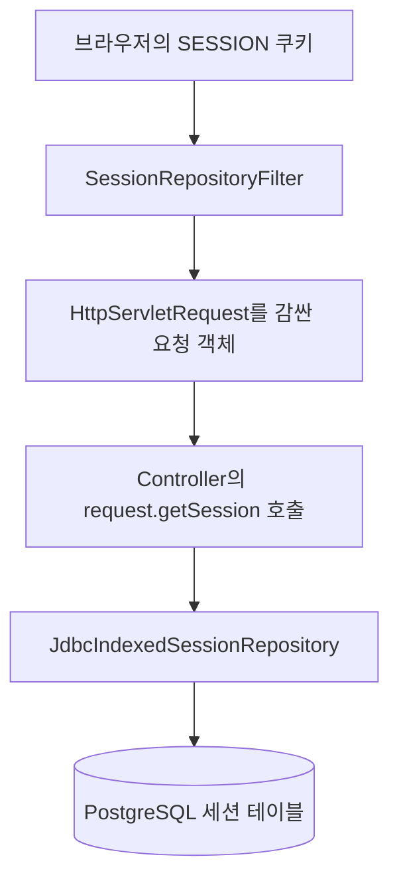

# Spring Session JDBC — HttpSession의 저장소를 PostgreSQL로 바꾸기

> **한 줄 요약:** `HttpSession`은 사용하는 API이고, Spring Session은 그 구현과 저장소를 교체하는 라이브러리다. JDBC 방식은 세션을 관계형 DB에 저장해 서버 프로세스 밖에서 유지·공유한다.

읽는 순서: [세션·쿠키 기초](../../infra/network/sessions-and-cookies.md) → [HttpSession](./http-session.md) → **이 노트**

## 1. 언제 쓰나

예를 들어 서버 A의 메모리에만 장바구니 세션을 보관하면, 다음 요청이 서버 B로 갔을 때 B는 그 세션을 찾지 못할 수 있다. 재시작 이후 유지도 저장·복원 구성에 따라 달라진다.

세션을 공용 DB에 두면 두 서버가 같은 저장소에서 조회할 수 있다. 서버가 교체돼도 **DB 데이터·세션 유효기간·클라이언트 쿠키가 유지되고 설정이 호환되면** 상태를 이어갈 수 있다. 재시작만으로 영구 보존이 보장되는 것은 아니다. 관련: [스케일 아웃](../../infra/scaling.md).

## 2. 이름이 비슷한 세 가지

| 이름 | 역할 |
| --- | --- |
| `HttpSession` | Java 코드가 세션을 읽고 쓰는 Servlet 인터페이스 |
| Spring Session | `HttpSession` 구현을 교체하고 저장소에 연결 |
| Spring Security | 인증·인가·보안 처리. Spring Session과 함께 사용할 수 있음 |

**Spring Session을 설치했다고 로그인 기능이 생기지는 않는다.** 로그인 없는 방문자의 상태도 저장할 수 있다.

Spring Session을 쓰기 전후 모두 다음 API를 사용할 수 있다.

```java
HttpSession session = request.getSession();
session.setAttribute("cartId", "cart-42");
```

바뀌는 것은 이 호출 아래에서 데이터를 어디에 저장하는가다.

### Spring Session이 맡는 것과 우리가 맡는 것

| 역할 | 담당 |
| --- | --- |
| 세션 ID 생성·쿠키에서 ID 읽기 | 세션 구현과 쿠키 처리기 |
| 세션 저장·복원·비활성 만료 | Spring Session과 선택한 저장소 |
| 세션에 어떤 값을 넣을지 결정 | 애플리케이션 |
| 현재 방문자가 해당 장바구니를 볼 수 있는지 검사 | 애플리케이션의 권한 규칙 |
| 아이디·비밀번호 확인, 로그인·로그아웃 처리 | 인증 기능. 보통 Spring Security 등을 사용 |

예를 들어 Spring은 `cartId = cart-42`를 저장해 줄 수 있다. 하지만 “이 사용자가 cart-42에 담긴 주문을 결제해도 되는가”라는 업무 규칙까지 알아서 판단하지는 않는다.

## 3. 왜 request 코드를 안 바꿔도 DB에서 조회할까?



Spring Session의 `SessionRepositoryFilter`가 요청·응답을 감싼다. 그 요청에서 `getSession()`을 호출하면 Spring Session이 제공하는 구현이 사용된다. JDBC 저장소는 세션 ID를 기준으로 DB를 조회하고, 응답 커밋 전이나 요청 종료 시점 등에 변경 사항을 저장한다. **매번 `getAttribute()`를 호출할 때마다 별도 SQL을 날린다는 뜻은 아니다.** [HttpSession 통합](https://docs.spring.io/spring-session/reference/http-session.html)

필터는 Controller보다 앞에서 요청을 처리하는 Servlet 구성 요소다. Spring Boot 자동 구성을 사용하면 직접 필터를 등록할 필요가 없다. [Boot JDBC 가이드](https://docs.spring.io/spring-session/reference/guides/boot-jdbc.html)

### 요청을 “감싼다”는 말의 의미

Controller가 받는 매개변수의 선언은 계속 `HttpServletRequest`다. 다만 실제 객체는 Spring Session이 기능을 덧붙인 **래퍼(wrapper)**일 수 있다. 래퍼는 원래 요청의 URL·헤더 같은 기능을 전달하면서 세션 조회 동작을 자신의 구현으로 연결한다.

개념적으로는 다음과 같다. 아래는 내부 흐름 설명이며 실제 클래스의 전체 구현은 아니다.

```text
Controller: request.getSession(false)
                 ↓
Spring Session이 감싼 request
  1. 이번 요청에서 이미 읽은 세션이 있으면 재사용
  2. 쿠키에서 세션 ID 확인
  3. SessionRepository에서 유효한 세션 조회
  4. 있으면 HttpSession 형태로 반환
  5. 없으면 false이므로 null 반환
```

이 때문에 업무 코드가 `JdbcIndexedSessionRepository`를 직접 주입받을 필요가 없다. `HttpSession`이라는 동일한 사용법 뒤에서 저장소 연동이 일어난다.

### 조회만 하는 GET도 DB에 쓴다

요청 흐름 자체(첫 요청에서 생성 → 쿠키 발급 → 다음 요청에서 조회)는 [HttpSession §7](./http-session.md)과 같고, 다른 점은 저장 위치뿐이다. 하나만 주의한다 — 다음 요청에서 `getSession(false)`로 세션을 찾으면 저장된 바이트를 Java 값으로 복원하고, **세션에 접근했으므로 마지막 접근 시각도 갱신**해 요청 끝에 저장소에 반영한다. **`getSession(false)`를 쓴 GET이라고 세션 DB에 SELECT만 일어난다고 가정하면 안 된다.** 생성 여부와 기존 세션의 접근 시각 갱신은 다른 일이다.

### 이름에 Session이 들어간 세 부품

```text
HttpSessionIdResolver: 쿠키(기본 CookieHttpSessionIdResolver)·헤더에서 세션 ID를 읽고 응답에 실어 보냄
SessionRepository:     그 ID의 세션을 저장소(JdbcIndexedSessionRepository)에서 읽고 저장
HttpSession:           업무 코드가 세션 속성을 다루는 인터페이스
```

셋 다 Spring Session(또는 Servlet)이 제공하는 것이라 **업무 코드가 Resolver를 직접 주입·호출할 필요는 없다.** `request.getSession()`으로 세션을 만들고 속성을 저장하면 필터가 저장과 쿠키 전달을 조정한다. Resolver의 `expireSession()`은 클라이언트 쿠키만 만료시키고 DB 세션은 지우지 않는다 — 로그아웃은 `session.invalidate()` 흐름으로 한다.

## 4. Spring Boot 4.1 설정 예시

기존 Spring MVC 애플리케이션에 Boot의 의존성 관리가 적용돼 있다고 가정한다.

```groovy
implementation 'org.springframework.boot:spring-boot-starter-session-jdbc'
runtimeOnly 'org.postgresql:postgresql'
```

이미 PostgreSQL 드라이버가 있으면 중복 추가하지 않는다. 이 구성에서는 자동 구성을 사용하므로 `@EnableJdbcHttpSession`을 별도로 붙이지 않는다. [Spring Boot 세션 설정](https://docs.spring.io/spring-boot/reference/web/spring-session.html)

```yaml
spring:
  datasource:
    url: ${DB_URL}
    username: ${DB_USERNAME}
    password: ${DB_PASSWORD}
  session:
    timeout: 30m
    jdbc:
      initialize-schema: never

server:
  servlet:
    session:
      cookie:
        name: SESSION
        http-only: true
        secure: true
        same-site: lax
        path: /
```

`max-age`를 두지 않아 SESSION 쿠키는 브라우저를 닫으면 사라지는 세션 쿠키가 된다(OWASP 권장). 서버 비활성 만료(30분)와 쿠키 수명은 별개이고, "로그인 유지"는 쿠키 `max-age`를 늘려서가 아니라 remember-me로 푼다 → [세션·쿠키 기초 §4](../../infra/network/sessions-and-cookies.md). 로컬 HTTP 개발에서는 `secure` 설정도 별도로 맞춘다.

**`secure`를 명시하지 않으면 `request.isSecure()`로 결정된다.** Tomcat의 세션 쿠키와 Spring Session의 `DefaultCookieSerializer` 모두 그렇다. 로드밸런서가 TLS를 벗기고 앱에는 HTTP로 넘기면 앱은 요청을 HTTP로 보므로 Secure가 안 붙고, 요청 스킴으로 만든 리다이렉트도 `http://`로 나간다. `SameSite=None`을 쓰는 쿠키라면 Secure가 빠진 순간 브라우저가 쿠키 자체를 거부한다. 두 가지를 같이 한다: 위처럼 `secure: true`를 **명시**하고, `server.forward-headers-strategy=native`(Tomcat `RemoteIpValve`) 또는 `framework`(`ForwardedHeaderFilter`)로 `X-Forwarded-Proto`를 신뢰하게 한다. [Spring Boot — 프록시 뒤에서 실행](https://docs.spring.io/spring-boot/how-to/webserver.html#howto.webserver.use-behind-a-proxy-server)

| 설정 | 누가 사용하는가 | 실질적인 효과 |
| --- | --- | --- |
| `spring.datasource.*` | DB 연결 구성 | 세션을 저장할 PostgreSQL 접속 정보 |
| `spring.session.timeout` | Spring Session | 서버의 비활성 세션 만료 기준 |
| `spring.session.jdbc.initialize-schema` | DB 초기화 구성 | 시작 시 프레임워크가 세션 테이블을 만들지 여부 |
| `server.servlet.session.cookie.*` | 쿠키 처리 구성 | 브라우저에 내려줄 이름·보안 옵션·보관 기간 |

Spring Boot는 등록된 DataSource와 세션 모듈을 이용해 필요한 저장소·필터 등을 자동 구성한다. **자동 구성은 “객체를 대신 조립”하는 것이며, DB 자체를 설치하거나 운영용 DB 권한을 만들어 준다는 뜻은 아니다.**

`initialize-schema: never`는 테이블이 필요 없다는 뜻이 아니다. **테이블 생성을 Flyway 등 다른 수단이 맡는다는 뜻**이다.

1. 사용 중인 Spring Session 버전의 `org/springframework/session/jdbc/schema-postgresql.sql`을 확인한다.
2. 해당 SQL을 새 Flyway 버전 마이그레이션으로 등록한다. 이미 적용된 마이그레이션은 수정하지 않는다.
3. 애플리케이션이 세션을 사용하기 전에 마이그레이션이 적용되도록 한다.

## 5. 테이블에는 무엇이 저장되나?

| 테이블 | 주요 내용 |
| --- | --- |
| `SPRING_SESSION` | 세션 ID, 생성·마지막 접근·만료 시각, 최대 비활성 시간 |
| `SPRING_SESSION_ATTRIBUTES` | 세션별 속성 이름과 직렬화한 값 |

PostgreSQL에서 따옴표 없이 생성한 이름은 보통 `spring_session`처럼 소문자로 보인다. 속성 값은 기본적으로 직렬화한 바이트로 저장되므로 `cartId` 문자열을 넣어도 SQL 조회에서는 그대로 읽히는 텍스트가 아닐 수 있다. 별도 JPA Entity를 만들 필요는 없다. Spring Session JDBC가 테이블을 관리한다. [JDBC 저장 구조](https://docs.spring.io/spring-session/reference/configuration/jdbc.html)

만료 여부 판단과 실제 행 삭제는 구분한다. 만료된 세션은 유효한 세션으로 사용하지 않으며, JDBC의 기본 정리 작업은 주기적으로 만료 행을 제거한다. 삭제 작업이 돌기 전 DB에 행이 보인다고 유효한 세션인 것은 아니다.

시계가 세 개 따로 돈다는 점을 같이 기억한다.

| 시계 | 기준 | 어디에 |
| --- | --- | --- |
| 서버 비활성 만료 | `EXPIRY_TIME = LAST_ACCESS_TIME + MAX_INACTIVE_INTERVAL`. 세션을 건드리는 요청마다 다시 계산 → **마지막 접근 후 N** | `SPRING_SESSION` 행, `spring.session.timeout` |
| 만료 행 물리 삭제 | `EXPIRY_TIME`이 지난 행을 지우는 스케줄. Boot 기본 **1분마다** | `spring.session.jdbc.cleanup-cron` (기본 `0 * * * * *`). FK cascade로 속성 행도 함께 삭제 |
| 브라우저 쿠키 만료 | `Max-Age` 없으면 브라우저 종료 시, 있으면 `Set-Cookie`를 내린 시점 기준 | 브라우저. 서버 행과 **독립** |

PostgreSQL에는 Redis의 TTL 같은 자동 만료가 없다. `EXPIRY_TIME`은 epoch 밀리초 **숫자**일 뿐이고, 비교(조회 시 Java에서)와 삭제(정리 작업의 `DELETE ... WHERE EXPIRY_TIME < ?`)는 전부 Spring Session이 한다. 그래서 행은 "유효 / **만료됐지만 정리 전** / 삭제됨" 세 상태를 거치며, 가운데 상태의 행을 들고 와도 세션으로 인정되지 않는다. "행이 있다 → 유효"가 아니라 "행에 적힌 시각이 안 지났다 → 유효"다. 직접 확인:

```sql
SELECT session_id,
       to_timestamp(last_access_time / 1000) AS last_access,
       to_timestamp(expiry_time / 1000)      AS expires_at,
       expiry_time < extract(epoch FROM now()) * 1000 AS expired
FROM spring_session;
```

쿠키만 먼저 사라지면 서버 행은 정리 전까지 아무도 못 찾는 고아가 되고, 서버 행만 먼저 만료되면 브라우저가 계속 보내는 ID를 서버가 무시한다(두 만료의 개념은 [세션과 쿠키](../../infra/network/sessions-and-cookies.md) 4절). 세션에 묶인 업무 자원의 수명을 세션 수명 이하로 맞추는 판단은 [HMAC과 해시](../security/hmac-and-hashing.md) 6절 💡 참고.

### 두 테이블이 나뉜 이유

세션 한 개에 속성은 여러 개일 수 있다. 개념상 **세션 1개 : 속성 N개** 관계다.

```text
SPRING_SESSION
  PRIMARY_ID: 내부 행 식별자 P1
  SESSION_ID: 브라우저의 세션 식별자 S1
  만료 시각 등

SPRING_SESSION_ATTRIBUTES
  P1 + preferredLanguage → 직렬화한 "ko"
  P1 + cartId            → 직렬화한 "cart-42"
```

P1·S1은 설명용 축약 표기다. `PRIMARY_ID`는 DB 내부 관계를 연결하는 키이고 `SESSION_ID`는 세션 조회에 쓰는 ID다. 세션 ID가 변경돼도 속성 행과의 관계를 내부 키로 유지할 수 있다. 장바구니 상품 전체가 이 테이블에 있어야 하는 것은 아니다. `cartId`만 세션에 두고 실제 상품 목록은 업무 테이블에서 조회할 수 있다.

### 테이블 이름은 고정인가?

`SPRING_SESSION`은 기본 이름이다. Boot에서는 `spring.session.jdbc.table-name`으로 바꿀 수 있고 관련 속성 테이블은 기본적으로 `_ATTRIBUTES` 접미사를 사용한다. 이미 만든 테이블을 설정 한 줄이 자동으로 이름 변경해 주지는 않는다. 스키마·인덱스·제약 이름을 포함한 마이그레이션도 함께 검토한다. 처음에는 기본 이름을 쓰면 공식 스키마와 비교하기 쉽다.

Flyway의 실행 이력·체크섬·SQL 수정 규칙은 [Flyway 노트](../../database/flyway-migrations.md)로 분리했다.

## 6. 저장 방식 비교

| 구성 | 맞는 상황 | 비용·주의점 |
| --- | --- | --- |
| 컨테이너 기본 `HttpSession` | 단일 서버에서 간단히 시작 | 메모리 사용, 재시작 유지·서버 간 공유 구성 확인 |
| Spring Session JDBC | 기존 관계형 DB를 활용해 유지·공유 | 세션 조회·갱신이 DB 부하에 추가됨 |
| Spring Session Redis | Redis를 운영하며 세션 저장소를 분리하려는 경우 | Redis 운영·가용성·데이터 보존 정책 필요 |
| 직접 만든 난수 토큰 | 목적이 좁고 별도 토큰 정책이 필요한 경우 | 발급·검증·만료·폐기 책임을 직접 설계 |

JDBC를 사용한다고 업무 데이터도 JDBC로 다시 작성할 필요는 없다. **업무 데이터는 JPA, 세션 데이터는 Spring Session JDBC**로 함께 사용할 수 있다.

## 7. ⚠️ 적용할 때 혼동하기 쉬운 점

**`JSESSIONID`와 `SESSION`은 기본 쿠키 이름이 다르다.** Tomcat의 기본 Servlet 세션에서는 보통 `JSESSIONID`, Spring Session의 기본 쿠키 처리에서는 `SESSION`을 사용한다. 이름은 설정 가능하며 이름만 바꾼다고 기존 세션 데이터가 자동 이관되지는 않는다.

**서버 접근 시각이 갱신돼도 쿠키 수명은 연장되지 않는다.** 둘은 다른 시계다(§5 표). `max-age`를 준 지속 쿠키라면 보관 기간을 늘리려면 `Set-Cookie` 재발급이 따로 필요하다.

**DB에 저장한다고 동시 요청이 직렬화되지는 않는다** — 원리와 처방은 [HttpSession §6](./http-session.md)과 같다.

**세션 값은 DB에 직렬화된 바이트로 남는다.** 클래스 구조를 바꿔 배포하면 이미 저장된 행의 역직렬화가 깨질 수 있고, JPA Entity를 넣으면 프록시 직렬화 문제까지 생긴다. 단순 ID·문자열을 우선 쓰고(이유는 [HttpSession §6](./http-session.md)), 기본 직렬화를 JSON 등으로 교체하는 것은 필요할 때 따로 검토한다.

### JPA의 더티 체킹과 같다고 생각하면 안 된다

JDBC 구현 4.1.1의 기본 저장 모드는 `ON_SET_ATTRIBUTE`이며, 기본 flush 모드는 `ON_SAVE`다. 이 중 저장 모드는 **어떤 속성을 변경된 것으로 추적할지**, flush 모드는 **저장소에 언제 반영할지**에 관한 설정이다.

세션에서 꺼낸 변경 가능한 객체의 내부 필드만 바꿨다고 JPA Entity처럼 변경을 자동 감지한다고 가정하면 안 된다. 변경한 속성은 `setAttribute()`로 다시 알려주는 방식이 명확하다. 처음에는 문자열·ID 같은 단순한 값을 통째로 교체하는 편이 이해하기 쉽다.

```java
HttpSession session = request.getSession();
session.setAttribute("preferredLanguage", "en");
```

`setAttribute()` 호출과 DB 커밋은 같은 순간이라고 보장되지 않는다. 또한 Spring Session JDBC의 기본 저장 트랜잭션은 업무 서비스의 트랜잭션과 별도로 동작한다. **업무 저장이 롤백되면 세션 변경도 함께 롤백된다고 가정하지 않는다.** [4.1.1 구현](https://github.com/spring-projects/spring-session/blob/4.1.1/spring-session-jdbc/src/main/java/org/springframework/session/jdbc/JdbcIndexedSessionRepository.java), [JDBC 트랜잭션 구성](https://docs.spring.io/spring-session/reference/configuration/jdbc.html#customizing-transactions)

## 8. 처음 확인할 때의 점검 순서

| 관찰된 현상 | 먼저 확인할 것 |
| --- | --- |
| `getSession(false)`가 계속 `null` | 세션을 생성한 요청이 있었는지, 브라우저가 쿠키를 실제로 보내는지 |
| 쿠키는 있는데 세션을 못 찾음 | DB 세션 존재·만료, 연결한 DB 환경, 쿠키 이름·경로 |
| 테이블이 없다는 SQL 오류 | Flyway 적용 여부, `initialize-schema`와 마이그레이션 책임 |
| 값이 다음 요청에서 사라짐 | `request`와 `session` 중 어디에 저장했는지, 속성 이름, 직렬화·저장 방식 |
| 서버 한 대에서는 되고 다른 서버에서는 안 됨 | 두 서버의 공용 세션 저장소·쿠키 설정·직렬화 호환성 |
| 로컬은 되는데 운영(LB 뒤 HTTPS)에서만 쿠키에 Secure가 안 붙음, `SameSite=None` 쿠키가 거부됨, 리다이렉트가 `http://`로 나감 | 앱이 요청을 HTTP로 보는지: `secure` 명시 여부, `server.forward-headers-strategy`로 `X-Forwarded-Proto` 신뢰 여부(§4) |

설정을 바꾸기 전에 **응답 Set-Cookie → 다음 요청 Cookie → DB의 유효한 세션 → 속성 이름** 순서로 확인한다. 브라우저가 쿠키를 보내지 않는 문제를 DB나 JPA 문제로 좁혀 보면 원인을 놓치기 쉽다.

## 9. 스스로 설명해 보기

1. Spring Session JDBC를 추가하면 Controller의 `HttpSession`을 다른 타입으로 바꿔야 할까?
2. `JSESSIONID`를 `SESSION`으로 이름만 바꾸면 세션이 DB에 저장될까?
3. 세션 테이블을 우리가 JPA Entity로 만들어야 할까?
4. 쿠키를 보낸 요청이므로 무조건 로그인한 사용자라고 봐도 될까?

답: **아니오, 구현·저장소가 바뀜 / 아니오, 저장소 구성이 필요 / 아니오, Spring Session이 관리 / 아니오, 인증은 별도.**

## 참고·학습 기록

- [Spring Session — Boot JDBC 가이드](https://docs.spring.io/spring-session/reference/guides/boot-jdbc.html)
- [Spring Session — HttpSession 통합](https://docs.spring.io/spring-session/reference/http-session.html)
- [Spring Session — JDBC 구성·스키마·만료 정리](https://docs.spring.io/spring-session/reference/configuration/jdbc.html)
- [Spring Boot — Spring Session 자동 구성](https://docs.spring.io/spring-boot/reference/web/spring-session.html)
- [Spring Session — CookieHttpSessionIdResolver API](https://docs.spring.io/spring-session/docs/current/api/org/springframework/session/web/http/CookieHttpSessionIdResolver.html)
- [Spring Session 4.1.1 — 공식 PostgreSQL 스키마](https://github.com/spring-projects/spring-session/blob/4.1.1/spring-session-jdbc/src/main/resources/org/springframework/session/jdbc/schema-postgresql.sql)
- [Spring Session 4.1.1 — JDBC 구현과 기본 저장 모드](https://github.com/spring-projects/spring-session/blob/4.1.1/spring-session-jdbc/src/main/java/org/springframework/session/jdbc/JdbcIndexedSessionRepository.java)
- 기준: Spring Boot 4.1.1 / Spring Session 4.1.1. 예시는 일반화한 학습용 설정이며 독립 실행 프로젝트는 아니다.
- [Spring Session 4.1.1 — HttpSessionIdResolver](https://github.com/spring-projects/spring-session/blob/4.1.1/spring-session-core/src/main/java/org/springframework/session/web/http/HttpSessionIdResolver.java)
- 보강: 2026-09-22. ID resolver·저장소·HttpSession의 역할 차이, 테이블 이름 변경과 Flyway 노트 링크.
- 정리: 2026-10-02. 예시에서 SESSION 쿠키 `max-age`를 빼 [세션·쿠키 기초](../../infra/network/sessions-and-cookies.md) 💡와 맞춤, http-session·세션 기초와 겹치는 설명은 링크로 축약.
- 학습일: 2026-09-21. 계기: 직접 만든 토큰과 표준 세션 관리의 책임 차이, DB에 저장되는 HttpSession의 동작 이해하기.
- 보강: 2026-09-21. TLS 종료 프록시 뒤에서 `secure` 미명시 시 `request.isSecure()`에 의존하는 함정과 `forward-headers-strategy` 처방(§4·§8), remember-me 링크 추가.

💡 **기존 PostgreSQL로 방문자 상태를 재시작 후에도 이어야 한다면 Spring Session JDBC부터 검토하고, 별도 Redis 운영은 실제 부하와 운영 요구가 생겼을 때 선택한다.**
