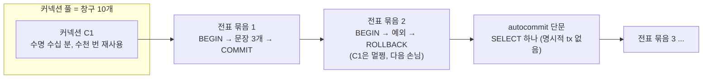
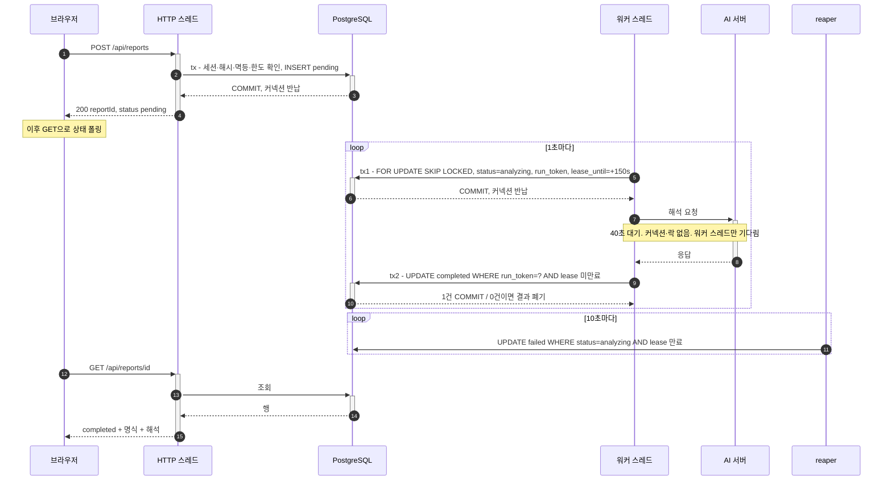
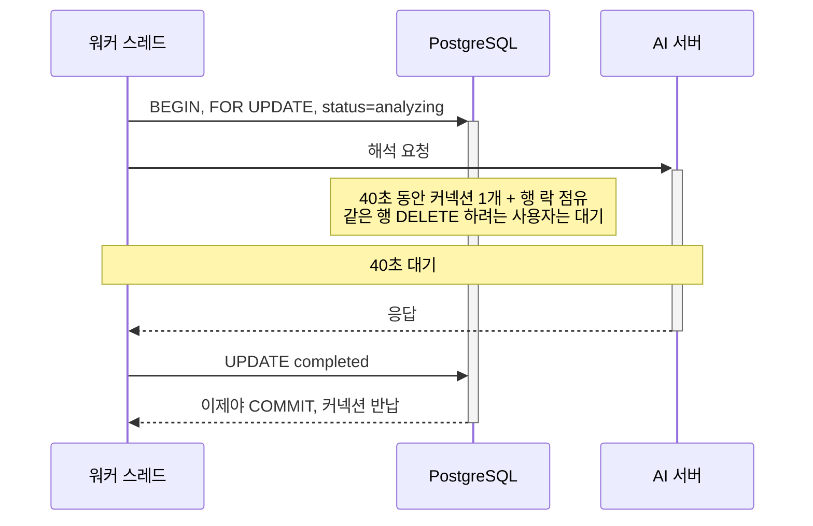
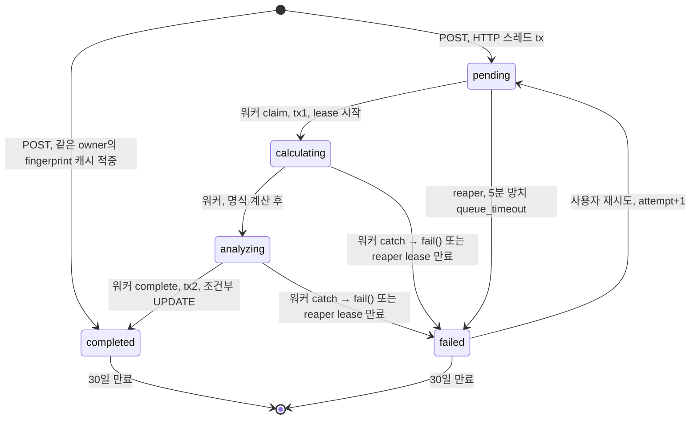
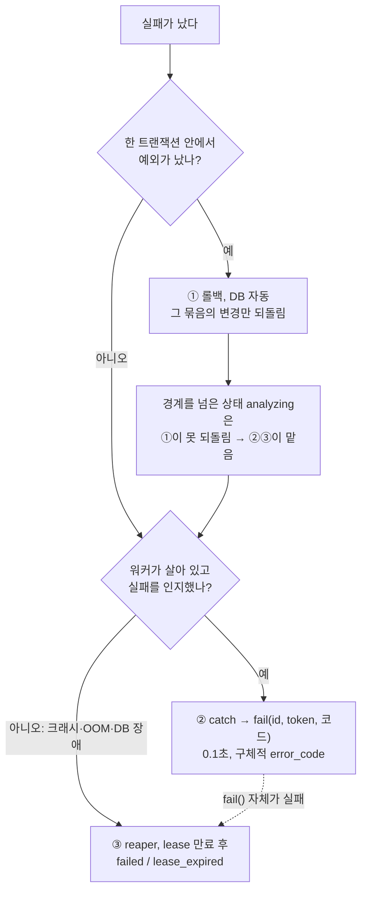

# @Transactional — 선언적 트랜잭션, 전파(propagation), 롤백 규칙

> **한 줄 요약**: 메서드에 트랜잭션 경계를 선언적으로 부여하는 Spring 어노테이션. AOP 프록시가 메서드를 감싸 **시작 → 실행 → (정상)커밋 / (예외)롤백**을 자동 처리한다. 핵심은 **전파(propagation)** 와 **롤백 규칙**, 그리고 **프록시 기반이라 생기는 함정**.

관련 노트: [예제로 보는 전파·롤백 (a→b→c 워크스루)](./transaction-rollback-example.md) · [영속성 컨텍스트 · flush · 더티 체킹](../jpa/persistence-context.md) · [Read-Modify-Write와 트랜잭션 경계](../jpa/read-modify-write.md) · [@Lock 실무 패턴](../jpa/lock-practical.md)

---

## 1. 무엇을 하나

```java
@Transactional
public void transfer(Long from, Long to, long amount) {
    accountRepo.minus(from, amount);
    accountRepo.plus(to, amount);
}   // 정상 종료 → commit / 도중 예외 → 전체 rollback
```

- **선언적 트랜잭션**: `try-commit-catch-rollback`을 코드로 안 쓰고 어노테이션으로 위임.
- Spring이 **AOP 프록시**로 대상 빈을 감싼다. 메서드 호출이 프록시를 거치면서:
  ```
  프록시: 트랜잭션 시작 → 실제 메서드 실행 → 예외 없으면 commit / 있으면 rollback
  ```
- 메서드 단위. 클래스에 붙이면 그 클래스의 **모든 public 메서드**에 적용.

비유: 커넥션 풀 = **은행 창구 10개**, **창구 = 커넥션**(앱–DB 사이의 긴 수명 통로), **트랜잭션 = 그 창구에서 처리하는 전표 한 묶음**(`BEGIN` → 일 → `COMMIT`/`ROLLBACK`). 창구는 아침에 열어 저녁까지 쓰고 손님마다 묶음 하나를 처리한다. 묶음 중간에 문제가 나면 그 묶음의 전표만 전부 찢고(롤백) 창구는 그대로 다음 손님을 받는다. 커넥션 1 : 트랜잭션 N(시간순), 트랜잭션 1 : 커넥션 1.

| | 커넥션 | 트랜잭션 |
| --- | --- | --- |
| 수명 | 길다(풀이 수십 분 재사용) | 짧다(밀리초~초) |
| 실패 시 | 끊어지면 풀이 교체 | 롤백. 커넥션은 멀쩡 |
| 소유 상태 | `SET` 설정·임시 테이블·**세션 수준 advisory lock** | 행 락·미커밋 변경·**트랜잭션 수준 advisory lock** |



⚠️ **"에러나면 다 롤백"의 "다"는 그 트랜잭션 안의 DB 변경만이다.** 범위 밖 세 가지: ① 다른 트랜잭션이 이미 커밋한 것 ② DB 밖에서 한 일(외부 API·메일·파일) ③ **커넥션에 속한 상태** — `SET`, 세션 수준 `pg_advisory_lock`은 롤백 뒤에도 남는다. `pg_advisory_xact_lock`을 쓰는 이유가 이것([advisory lock](../../database/postgres-advisory-lock.md)).

Spring은 둘의 시간 경계를 **거의 일치**시킨다. `@Transactional` 진입 시 커넥션을 빌리고 종료 시 반납하므로 **트랜잭션이 열린 시간 = 커넥션 점유 시간**. `@Transactional` 없으면 문장마다 빌리고 바로 반납(autocommit). 한 방향만 성립: 트랜잭션이 열려 있으면 커넥션은 반드시 점유 중이지만, 커넥션 점유 중이라고 트랜잭션이 열린 것은 아니다. **"@Transactional 메서드 안에 있다" = "창구에 앉아 전표 묶음을 처리 중이다".**

**Spring 트랜잭션과 DB 트랜잭션은 같은 것의 두 층이다.** DB 트랜잭션은 `BEGIN … COMMIT/ROLLBACK`, 한 커넥션 위에서 격리·락·원자성을 DB가 보장하는 단위. `@Transactional`은 그 BEGIN/COMMIT을 **누가 언제 부를지** 관리하는 층이다. 프록시가 메서드 진입 시 풀에서 커넥션을 꺼내 `setAutoCommit(false)`로 BEGIN 상태를 만들고 **현재 스레드에 바인딩** → 메서드 안의 JPA·`JdbcTemplate` 호출이 전부 그 커넥션을 탄다 → 정상 반환이면 `COMMIT`, `RuntimeException`이면 `ROLLBACK` → 커넥션 반납. 단일 DataSource면 **Spring 트랜잭션 1 = DB 트랜잭션 1 = 커넥션 1**이다. Spring이 얹는 것은 전파·롤백 규칙·커밋 후 콜백·읽기 전용 힌트 같은 관리 기능이고, 격리 수준·락·커밋 자체는 DB 것이다. 설계 문서의 "DB 트랜잭션 밖"은 코드로는 "`@Transactional` 범위 밖", 물리적으로는 "이 순간 스레드에 바인딩된 커넥션이 없음"과 같은 말이다. (JTA로 여러 리소스를 묶으면 1:N이 되지만 예외적.)

> JPA와의 연결: 트랜잭션 = 영속성 컨텍스트의 수명. commit 직전 **flush**로 모아둔 SQL이 나간다. ([영속성 컨텍스트](../jpa/persistence-context.md))

---

## 2. 주요 속성

| 속성 | 의미 | 비고 |
|------|------|------|
| `propagation` | 기존 트랜잭션이 있을 때 어떻게 할지 | 기본 `REQUIRED` (→ §3) |
| `isolation` | 격리 수준 | 기본 `DEFAULT`(DB 설정 따름) |
| `readOnly` | 읽기 전용 힌트 | 조회 전용 서비스에. flush 안 함 → 약간의 최적화 |
| `rollbackFor` | 이 예외에도 롤백 | 기본은 unchecked만 롤백 (→ §4) |
| `noRollbackFor` | 이 예외엔 롤백 안 함 | |
| `timeout` | 제한 시간(초) 초과 시 롤백 | 긴 트랜잭션 방어 |

---

## 3. 전파 (Propagation) — 기존 트랜잭션이 있을 때 어떻게?

| 옵션 | 동작 |
|------|------|
| **`REQUIRED`** (기본) | 있으면 **합류**, 없으면 새로 시작. 대부분 이거. |
| **`REQUIRES_NEW`** | 기존 걸 **멈추고(suspend) 완전히 새 독립 트랜잭션** 시작 |
| `NESTED` | 기존 트랜잭션 안에 **savepoint**. 부분 롤백 가능(savepoint까지만). 커넥션은 공유 |
| `SUPPORTS` | 있으면 합류, 없으면 트랜잭션 없이 실행 |
| `NOT_SUPPORTED` | 트랜잭션 멈추고 **없이** 실행 |
| `MANDATORY` | 반드시 기존 트랜잭션 있어야 함. 없으면 예외 |
| `NEVER` | 트랜잭션 있으면 예외 |

### REQUIRED vs REQUIRES_NEW (제일 중요)

```java
@Transactional                    // outer (REQUIRED)
public void outer() {
    repo.doA();
    inner();                      // 같은 빈 호출이면 프록시 안 탐 주의(§5)! 보통 다른 빈
}

@Transactional(propagation = REQUIRED)      // ← outer에 합류 (같은 트랜잭션)
@Transactional(propagation = REQUIRES_NEW)  // ← 멈추고 새 트랜잭션
```

- **REQUIRED**: inner가 outer에 **합류** → 하나의 트랜잭션. inner든 outer든 한 곳에서 실패하면 **전부 롤백**.
- **REQUIRES_NEW**: outer를 **suspend**(커넥션을 옆에 치워둠) → inner가 **새 커넥션으로 독립 실행** → inner 커밋/롤백 → outer 재개. **같은 스레드의 동기 호출**(동시성 대기 아님).

---

## 4. REQUIRES_NEW에서 inner 에러 → outer는? (핵심 질문)

REQUIRES_NEW는 **독립**이라, 아래 두 방향 모두 "서로 자동으로 끌고 가지 않는다". 두 경우는 **전제가 반대**다.

### (A) inner가 실패했을 때 → outer는 outer가 예외를 잡느냐에 달림

| inner 예외 처리 | inner | outer |
|------|-------|-------|
| outer가 **안 잡음**(위로 전파) | 롤백 | **롤백** (예외가 outer 밖으로 나가니까) |
| outer가 **try-catch로 잡음**(안 던짐) | 롤백 | **살아서 commit 가능** ← REQUIRES_NEW의 존재 이유 |

```java
@Transactional   // outer
public void outer() {
    repo.doMainWork();
    try {
        historyService.log(...);   // REQUIRES_NEW — 독립 트랜잭션, 여기서 예외
    } catch (Exception e) {
        // inner는 자기 트랜잭션만 롤백. outer는 예외를 삼켰으니 계속 진행 → commit OK
    }
}
```

> **inner 롤백 ≠ outer 롤백** — outer가 잡으면 outer는 산다. 안 잡고 전파하면 outer도 같이 롤백.

### (B) inner는 성공(커밋), 그 뒤 outer가 실패 → inner 커밋은 살아남는다

(A)와 **방향이 반대**다. inner는 정상 커밋했고, 그 다음 outer에서 실패가 난 경우.

```java
@Transactional                  // outer
public void placeOrder() {
    historyService.logAttempt(); // REQUIRES_NEW → 호출 끝나는 순간 독립 commit ✅ (영구 저장)
    paymentService.charge();     // 💥 여기서 예외 → outer 롤백
}
```
```
1. logAttempt() → REQUIRES_NEW라 inner 트랜잭션이 여기서 바로 commit (DB에 영구 기록)
2. charge()     → 예외
3. outer 롤백   → outer가 한 일만 되돌림.
   logAttempt()는 별개 트랜잭션으로 이미 커밋됐으니 → 그대로 남음 ✅
```

> **inner의 커밋은 outer가 롤백해도 안 지워진다.** 같은 트랜잭션(REQUIRED)이었다면 함께 롤백됐을 것. → "본 작업은 실패(롤백)해도 **시도 이력/로그/감사 기록은 남겨야** 한다"는 요구에 쓰는 패턴.

> 정리(양방향, 같은 성질): REQUIRES_NEW는 독립이라 **(A) inner 실패가 outer로 안 번지고(잡으면), (B) inner 성공이 outer 실패에 안 휩쓸린다.**

### inner 예외는 프록시에서 "롤백 → 재던짐"을 거쳐 전파된다

inner 예외가 outer로 **바로** 가는 게 아니다. inner는 프록시가 감싸고 있어서, 예외가 본문 밖으로 나오면 **프록시가 가로채 트랜잭션을 먼저 롤백한 뒤, 예외를 다시 던진다.**

```
[inner 프록시]  begin tx
   inner 본문 💥 예외
   → 프록시가 가로챔
   → ① inner 트랜잭션 rollback   ← '한 단계 더'
   → ② 예외 다시 throw
   ↓
outer가 예외 받음 (inner 트랜잭션은 이미 롤백 끝난 상태)
```

**outer에 트랜잭션이 없을 때(= inner가 독립 트랜잭션)는 오히려 깨끗한 케이스다.** inner만 롤백되고, outer는 트랜잭션이 없으니 예외를 잡으면 그냥 무탈하게 진행된다.

| 경우 | inner 트랜잭션 | outer가 inner 예외 잡으면 |
|------|---------------|--------------------------|
| **outer 트랜잭션 없음** | inner 독립 트랜잭션 | inner만 롤백, outer는 무탈하게 진행 ✅ |
| outer 트랜잭션 있음 + inner 합류(REQUIRED) | 공유 트랜잭션 | 공유 tx가 rollback-only → outer commit 때 `UnexpectedRollbackException` 💥 (아래) |

### ⚠️ 비교: REQUIRED(합류)는 "잡아도 못 살린다"

inner가 outer에 **합류**한 상태에서 inner가 예외를 던지면, **그 하나의 트랜잭션이 `rollback-only`로 마킹**된다. outer가 예외를 try-catch로 잡아도, **commit 시점에 `UnexpectedRollbackException`** 이 터진다.

```java
@Transactional
public void outer() {
    try {
        innerRequired();   // 합류된 트랜잭션. 여기서 RuntimeException
    } catch (Exception e) {
        // 잡았지만 소용 없음 — 트랜잭션은 이미 rollback-only
    }
}   // commit 시도 → UnexpectedRollbackException 💥
```

> 같은 트랜잭션을 공유하니, 한 군데서 깨지면 전체가 롤백 운명. "일부만 살리고 싶다"면 REQUIRES_NEW(완전 분리) 또는 NESTED(savepoint).

**`UnexpectedRollbackException`이 정확히 뭔가 / "잡아도 못 살림"의 의미**

commit하려는데 트랜잭션이 rollback-only라서 **"커밋 못 하고 롤백했다"** 고 스프링이 알리는 예외(commit 시점에 발생). 이름 = 호출자는 커밋(성공)을 기대했는데 롤백이 남 → "예상치 못한 롤백".

핵심은 **예외가 두 개**라는 것:
1. **원본 예외**(inner의 RuntimeException) → outer가 `catch`로 **잡음**.
2. **`UnexpectedRollbackException`** → 한참 뒤 outer가 **commit할 때 프록시(본문 바깥)에서** 새로 터짐 → try-catch는 이미 끝나서 **못 잡음**.

→ 즉 "잡아도 못 살림" = **원본 예외는 잡아 흐름은 멈췄지만, 트랜잭션은 이미 rollback-only(롤백 확정)라 살릴 수 없다.** catch로 "예외 흐름"은 막아도 "트랜잭션 운명"은 못 바꾼다.

> 스프링이 일부러 던지는 이유 = **안전장치.** 조용히 커밋하면 정합성이 깨지고, 조용히 롤백하면 "저장됐겠지" 착각한다. 그래서 "커밋된 줄 알겠지만 실제론 롤백됐다"를 예외로 **크게 알린다.**

**어디서 터지나 — inner/outer가 아니라 "물리 커밋 경계"가 기준**

`UnexpectedRollbackException`은 rollback-only 트랜잭션을 **물리적으로 커밋하는 경계**(= 물리 트랜잭션을 시작한 사람)에서 난다. 그래서:
- **REQUIRED로 합류한 inner는 커밋을 안 한다**(참여만) → 기본적으로 inner는 안 던지고 **최상위(outer)가** 던진다. (위 예시)
- 하지만 inner가 **커밋 경계이면 inner에서도 난다**:
  - **`REQUIRES_NEW` inner**: 자기 새 물리 트랜잭션의 커밋 경계 → 그 안에 합류한 더 깊은 호출이 실패해 rollback-only가 되면, **그 inner가 커밋할 때** 던짐.
  - **`failEarlyOnGlobalRollbackOnly = true`**(기본 false): 합류 inner도 커밋 시도 시 전역이 rollback-only면 **outer까지 안 기다리고 inner 경계에서 조기 발생**.
  - **outer에 트랜잭션이 없으면**: inner가 곧 최상위 = 커밋 경계 → inner에서 발생.

> 한 줄: 위치(inner/outer)가 아니라 **"누가 물리 트랜잭션을 커밋하느냐"** 가 기준. REQUIRED 단순 합류 inner만 (기본 설정에선) outer로 미뤄진다.

**헷갈림 정리: 롤백 ≠ `UnexpectedRollbackException`, 그리고 catch가 롤백을 막느냐**

- **롤백 자체로 `UnexpectedRollbackException`이 뜨는 게 아니다.** 이건 **rollback-only인데 `commit`을 시도할 때만** 나오는 *두 번째* 예외. 원본 예외(RuntimeException)는 "롤백을 유발"할 뿐, 그 자체가 `UnexpectedRollbackException`은 아니다.
- **catch해서 안 던지면 롤백이 막히나?** → 예외가 **트랜잭션 프록시 경계를 넘었는지**에 달렸다.
  - **같은 메서드 안에서** 프록시 경계 안 넘고 잡음 → 롤백 막힘(정상 커밋). (§5)
  - **별도 `@Transactional`(합류)이 던진 예외**를 잡음 → 그 경계를 넘으며 **이미 rollback-only가 찍힘** → catch해도 못 막음 → 커밋 시도 시 `UnexpectedRollbackException`.
  - (그 별도 호출이 `@Transactional` 없는 평범한 메서드면 경계가 없으니 잡으면 롤백 안 됨)

요점만: **합류(REQUIRED)한 호출이 던지면 공유 트랜잭션이 rollback-only로 오염**돼 outer가 catch해도 못 살린다(commit 때 `UnexpectedRollbackException`). **독립(REQUIRES_NEW)이면 그 트랜잭션만 롤백**되고 outer는 catch해 정상 커밋할 수 있다. → a→b→c 단계별 워크스루(잡음/다시던짐 × REQUIRED/REQUIRES_NEW)는 [예제로 보는 트랜잭션 전파·롤백](./transaction-rollback-example.md).

### rollback-only란 (스프링 기본 동작)

트랜잭션이 **"이제 커밋 불가, 롤백만 가능"** 으로 표시된 상태. **설정으로 켜는 게 아니라 스프링 트랜잭션의 기본 내장 동작**이다. 트랜잭션 범위에서 롤백 대상 예외가 발생하면 **자동으로** 이 플래그가 찍히고, 이후 **commit을 시도하면 `UnexpectedRollbackException`** 이 난다.

```
롤백대상 예외 발생 → status를 rollback-only로 자동 마킹
  → 이후 commit() 시도 → UnexpectedRollbackException
```

- 특히 **합류(REQUIRED) inner가 예외를 던지면 공유 트랜잭션 전체가** rollback-only (위 §4 함정의 원인).
- 제어 설정은 `globalRollbackOnParticipationFailure`(기본 `true`) 하나뿐 — 거의 안 건드린다.
- 그래서 **낙관적 락 재시도는 새 트랜잭션**에서 해야 한다(rollback-only 안 찍힌 깨끗한 상태). → [@Lock 실무 패턴 §6](../jpa/lock-practical.md)

---

## 5. 롤백 규칙

### (1) 롤백은 "예외가 메서드 밖으로 전파될 때" 일어난다 — catch해서 삼키면 커밋

선언적 롤백의 트리거는 **예외가 `@Transactional` 메서드 경계(프록시)를 빠져나가는 것**이다. 메서드 안에서 try-catch로 잡고 다시 안 던지면 → 프록시는 예외를 모른다 → **커밋된다.**

```java
@Transactional
public void doWork() {
    repo.save(a);
    try {
        repo.save(b);          // 💥 예외
    } catch (Exception e) {
        log.error("무시", e);   // 안 던짐
    }
    // 정상 종료 → 프록시는 예외를 모름 → COMMIT (롤백 안 됨!)
}
```

프록시가 메서드를 감싸는 모양:
```
begin()
try { 실제메서드(); commit() }       // 예외가 안 나오면 commit 경로
catch (롤백대상 예외 e) { rollback(); throw e }  // 예외가 올라와야 이 경로
```

> **실무에서 "왜 롤백이 안 되지?"의 1순위 원인** = try-catch로 예외를 삼킨 경우.

**예외 안 던지고도 롤백하려면 → 수동 마킹**
```java
} catch (Exception e) {
    TransactionAspectSupport.currentTransactionStatus().setRollbackOnly();  // 롤백 강제
}
```
`setRollbackOnly()`로 rollback-only 마킹하면 메서드가 정상 종료해도 프록시가 commit 대신 rollback한다. 즉 "무조건 throw해야 롤백"은 아니다.

### (2) 전파되더라도 — 체크 예외는 기본 롤백 안 한다

| 예외 종류 | 기본 동작 |
|-----------|-----------|
| `RuntimeException`, `Error` (unchecked) | **롤백** ✅ |
| `Exception` 등 checked 예외 | **롤백 안 함** ❗ (커밋됨) |

```java
@Transactional
public void save() throws IOException {
    repo.insert(...);
    throw new IOException();   // checked → 롤백 안 됨! insert가 커밋되어 버림
}
```

→ checked 예외에도 롤백하려면 명시:
```java
@Transactional(rollbackFor = Exception.class)
```

> 자주 당하는 함정. "예외 던졌는데 왜 데이터가 들어갔지?" → checked 예외라 롤백 안 된 것.

---

## 6. 자주 당하는 함정

### (1) self-invocation — 같은 클래스 내부 호출은 프록시를 안 탄다
```java
@Service
public class OrderService {
    public void a() {
        b();   // ❌ this.b() — 프록시 안 거침 → b()의 @Transactional 무시됨
    }
    @Transactional
    public void b() { ... }
}
```
→ AOP 프록시는 **외부에서 빈을 호출할 때만** 개입. 내부 호출은 프록시를 우회한다. 해결: 다른 빈으로 분리하거나 self-주입/`AopContext` (보통 분리가 정석).

**왜 그런가 — 객체가 두 개다.** `@Transactional`이 붙은 빈은 컨테이너 기동 시(빈 후처리 단계) 스프링이 **원본을 감싼 프록시 객체**를 하나 더 만들고, 컨테이너에는 **프록시를** 등록한다. 다른 빈이 `@Autowired OrderService`로 받는 것도 프록시다.

```
[프록시 OrderService$$SpringCGLIB]   ← 컨테이너에 등록된 것. 다른 빈이 주입받는 것.
   b() { 트랜잭션 시작 → 원본.b() → 커밋/롤백 }
        └─ 필드로 [원본 OrderService]를 들고 있음   ← 내 코드가 들어 있는 진짜 객체
```

바깥에서 `orderService.b()` → **프록시의** b() → 트랜잭션 코드 → 원본 b(). 하지만 원본 `a()` 안에서 `this.b()`의 `this`는 **원본 자신**이라 프록시를 거칠 기회가 없다. 프록시 바꿔치기 원리는 [빈 후처리기](../design/bean-post-processor.md).

**같은 함정 — `@PostConstruct` 안에서 자기 `@Transactional` 메서드 호출.** 초기화 메서드는 프록시 바꿔치기보다 **먼저** 실행된다(빈 생명주기 ⑤ → ⑥, [ApplicationContext §1](./application-context.md) 표). 그 시점엔 이 빈의 프록시가 아직 만들어지지도 않았고, 어차피 `this`는 원본이라 트랜잭션이 안 걸린다. `@PostConstruct`에서 **다른 빈**의 `@Transactional` 메서드를 부르는 건 그 빈이 이미 프록시라 정상 동작.

⚠️ **"트랜잭션은 기동 시 묶이나, 호출 시 묶이나?" — 둘 다 맞고 시점이 다르다.**

| 시점 | 일어나는 일 | 누가 |
|---|---|---|
| 기동 시 (한 번) | 프록시를 **설치**만 한다. 어느 메서드에 `@Transactional`이 붙었고 옵션이 뭔지 읽어 프록시 안에 기억. 트랜잭션은 아직 하나도 안 시작됨 | AutoProxyCreator |
| 호출 시 (매번) | 프록시 메서드가 불리면 **트랜잭션 시작 → 원본 호출 → 커밋/롤백**. 실제로 묶이는 건 이때 | 프록시 안의 `TransactionInterceptor` |

톨게이트를 세우는 건 기동 시, 요금을 받는 건 차가 지날 때마다. 그래서 프록시를 안 거치는 내부 호출은 **톨게이트 없는 길**을 가는 것과 같다 — 기동 시 설치된 게 있어도 그 길 위에 없으면 아무 일도 안 일어난다.

### (2) public 메서드에만 적용
Spring AOP 프록시 특성상 `private`/`protected`/package-private 메서드의 `@Transactional`은 **무시**된다(예외도 안 남). 반드시 `public`.

### (3) REQUIRES_NEW 커넥션 풀 데드락
outer가 커넥션을 쥔 채 suspend되고 inner가 **또 다른 커넥션**을 요구한다 → 동시에 2개 사용. 풀 크기가 작거나 동시 요청이 많으면 **커넥션 고갈 → 데드락**. REQUIRES_NEW 남발 주의.

### (4) 트랜잭션 안에서 외부 호출(HTTP/메시지) 금지
긴 외부 호출을 트랜잭션 안에 두면 그동안 커넥션·락을 잡고 있어 성능 저하. 외부 호출은 트랜잭션 밖으로.

**"트랜잭션 밖" ≠ 비동기.** 서로 직교하는 두 축이다. 비동기는 "누가 언제(어느 스레드·시점)" 실행하느냐, 트랜잭션 밖은 "그 순간 커넥션·BEGIN이 열려 있느냐"다.

| | 트랜잭션 **안**에서 외부 호출 | 트랜잭션 **밖**에서 외부 호출 |
| --- | --- | --- |
| 동기 (요청 스레드) | 흔한 사고. `@Transactional` 안에서 HTTP | 가능. `tx1 커밋 → HTTP → tx2`를 한 스레드에서 순차로 |
| 비동기 (워커) | 워커 메서드 전체에 `@Transactional` — 역시 사고 | 정석. 선점(짧은 tx) → 실행(tx 없음) → 결과 저장(짧은 tx) |

비동기로 보냈다고 트랜잭션 밖이 되는 게 아니다. 두 결정은 따로 내린다. 비동기의 이유는 **HTTP 요청 수명과 작업 수명 분리**(사용자를 40초 묶지 않기), 트랜잭션 밖의 이유는 **커넥션·락 점유 시간 최소화**다.

#### 그림으로 보기

시퀀스 다이어그램에서 참여자 아래 **세로로 긴 막대(활성 구간)** = 그 자원이 점유된 시간. DB 막대 길이가 "커넥션·락을 얼마나 들고 있었나"다.

**① D — 비동기 + 트랜잭션 밖 (설계된 정석). DB 막대가 짧고 두 번, AI 막대가 길다.**



**② C — 비동기 + 트랜잭션 안 (워커에 `@Transactional` 한 줄). 같은 워커인데 DB 막대가 AI 막대만큼 길다.**



A(동기·안)는 ②에서 워커 스레드를 HTTP 스레드로 바꾼 그림이고, B(동기·밖)는 ①의 워커 자리에 HTTP 스레드가 들어가 사용자가 40초 서 있는 그림이다.

**③ 상태 기계 — 누가 어느 화살표를 움직이나**



**④ 정리 책임 3층 — 실패가 나면 누가 치우나**



왜 묶으면 안 되나 — 성능 말고도 한 가지가 더 있다. **롤백은 외부를 되돌리지 못한다.** "전부 아니면 전무"는 DB 안에서만 성립한다. 외부 API는 이미 실행됐고 비용도 나갔다. HTTP 성공·DB 실패든 그 반대든 트랜잭션은 그 불일치를 해결해 주지 않는다. 묶어서 얻는 게 없으니 묶지 않고, 대신 "늦은 결과는 버린다"를 설계에 넣는다.

```java
// 조율 메서드 — @Transactional 없음
public void runOnce() {
    Optional<Claim> claim = claimer.claimNext();         // ① tx: FOR UPDATE SKIP LOCKED → status·run_token·lease_until 갱신 → 커밋(커넥션 반납)
    if (claim.isEmpty()) return;
    Result result = externalClient.call(claim.input());  // ② tx 없음. 커넥션도 락도 없음
    completer.complete(claim.id(), claim.runToken(), result);
    // ③ tx: UPDATE ... WHERE id=? AND status='running' AND run_token=? AND lease_until > now()  → 0건이면 늦은 결과 폐기
}
```

- ②동안 행이 잠겨 있지 않으므로 그 사이 reaper가 lease 만료 처리했거나 사용자가 삭제했을 수 있다. ③의 WHERE가 그 대가다([Read-Modify-Write](../jpa/read-modify-write.md)의 조건부 UPDATE). 잠금을 "쓰기 직전 확인"으로 바꾼 것.
- **쪼개면 롤백은 각 조각 안에서만 된다.** ③이 예외를 던지면 ③의 UPDATE만 롤백되고 ①은 40초 전에 커밋돼 안 돌아간다 → 행은 `running`·`run_token`·`lease_until` 그대로 남는다. 트랜잭션 경계를 넘는 되돌리기는 없으므로 **롤백의 자리를 "만료 시각 + 청소부(reaper) + 조건부 쓰기"가 채운다**. 실패 지점별: ② 외부 실패 → 세 번째 짧은 tx `fail(id, token, code)`로 즉시 기록, 그것도 실패하면 reaper / ③ 예외 → reaper가 lease 만료 후 `failed` / ③ 0건 → 이미 정리됨, 결과만 버림 / ② 중 크래시 → reaper(재시작 후에도 동작해야). 이게 saga·[Outbox](./event-outbox-pattern.md)의 원리이고, 나쁜 버전보다 코드가 많은 이유다.
- **reaper(청소부)** — 워커와 같은 `@Scheduled` 메서드지만 일을 하지 않고 **일하다 죽은 흔적을 치운다**(이름은 Unix의 zombie reaping). 주기 10초, `status IN ('running') AND lease_until < now()` → `failed`+`error_code`, 그리고 `pending`인데 N분 넘게 아무도 안 집은 행 → `queue_timeout`. 조건부 UPDATE라 여러 인스턴스가 돌아도 안전. 주방 비유: 요리사(워커)가 "150초 안에 끝낸다"고 적고(lease) 쓰러지면 매니저(reaper)가 주문표에 실패 도장. **lease가 reaper의 판단 근거이자 늦은 결과를 버리는 기준** — 죽은 게 아니라 느렸던 워커가 160초에 돌아와도 `WHERE run_token=? AND lease_until > now()`가 0건이라 `failed` 위에 `completed`를 덮어쓰지 못한다. 그래서 **작업 상한 < lease**(예: 120초 < 150초)로 잡는다. 재시작 시 만료 안 된 lease가 남아 있으면 reaper가 정리할 때까지 새 claim을 멈추는 보수적 규칙도 세트.
- **정리 책임은 3층이고 각 층은 앞 층이 못 하는 것을 맡는다.** ① 트랜잭션 롤백(DB 자동) — 한 묶음 안의 변경만 ② **`catch` + 보상 쓰기**(워커 자신) — 살아 있고 실패를 인지했을 때, 0.1초 안에 `fail(id, token, "ai_timeout")`처럼 **구체적 코드**로 ③ **타임아웃 스케줄러**(reaper) — 죽었거나 ②의 쓰기 자체가 실패했을 때, lease 만료 후 `lease_expired`처럼 **포괄적 코드**로. 한 줄: **살아 있으면 catch가, 죽었으면 스케줄러가.** ②만 있으면 프로세스 사망·OOM·DB 장애 시 catch가 실행되지 않아 구멍, ③만 있으면 3초 타임아웃에도 사용자가 lease+주기(150+10초)를 더 기다리고 이유도 모른다. 둘 다 `WHERE run_token=? AND status='running'` 조건부라 먼저 온 쪽 1건·나중 0건으로 충돌 없음. ⚠️ **Spring 이벤트(`ApplicationEvent`·`@TransactionalEventListener`·`@Async`)는 ③이 될 수 없다** — 프로세스 메모리에 살아 프로세스와 함께 죽는다([Outbox](./event-outbox-pattern.md) "메모리 큐 = 흔적 없는 증발"). 알림·통계 같은 ②의 부가 동작에만 쓰고, 되돌리기의 근거는 항상 **DB에 남은 것**(상태·lease)에 둔다.
- **"트랜잭션 밖" ≠ "기다리지 않음".** ②에서 워커 스레드는 40초 블로킹된다. 바뀐 건 그동안 **손에 든 것**: 나쁜 버전은 스레드 1 + 커넥션 1(풀 10개 중) + 행 락, 좋은 버전은 스레드 1만. 스레드는 수백~(가상 스레드) 수천 개라 싸고 커넥션은 10개라 귀하다. 스레드도 무한하지 않으니 워커 동시 실행 수는 별도로 제한한다.
- 초 단위로 보면: 나쁜 버전(메서드 하나에 `@Transactional`)은 창구·행 락을 **40초** 점유하고, 그동안 같은 행을 지우려는 사용자는 대기, 워커 5개면 창구 5개 소멸. AI가 실패해 롤백돼도 **AI는 이미 40초 계산했다** — 롤백이 되돌린 건 DB 두 줄뿐. 좋은 버전은 창구 점유 **0.01초 + 0.01초**, 그 사이 사용자 삭제는 즉시 실행.
- 4조합을 사용자 입장에서: A(동기+안) 사용자 40초 대기·창구 40초 / B(동기+밖) 사용자 40초 대기·창구 0.02초 / C(비동기+안) 사용자 즉시 응답·**창구는 여전히 40초** / D(비동기+밖) 둘 다 해결. A→B는 경계를 바꾼 것, A→C는 비동기로 바꾼 것. **워커 메서드에 `@Transactional` 하나 붙이면 D가 C로 떨어진다.**

**워커란** — 같은 Spring 앱 안에서 HTTP 요청과 무관하게 타이머로 도는 메서드(`@EnableScheduling` + `@Scheduled(fixedDelay = 1000)`, 전용 스레드 기본 1개). 별도 서버가 아니다. 주방 비유: 카운터 직원(HTTP 요청 스레드)은 주문표(`pending` 행)를 꽂고 번호표(id)를 주고 **끝**, 요리사(워커 스레드)는 1초마다 꽂이(DB)를 보고 하나 집어 요리, 손님(브라우저)은 번호로 반복 조회. 카운터와 요리사는 **다른 사람**이고 직접 대화 없이 DB만 본다 — 그래서 요리 40초여도 손님을 즉시 돌려보낼 수 있다(= 비동기). 스케줄링 자체는 Spring Batch와 별개([배치의 세 층위](./batch-three-meanings.md)). 이 구조가 **"DB를 큐로 쓴다"(polling)** — HTTP 요청은 행 한 줄(`pending`)을 넣고 즉시 응답, 외부 호출은 워커만 한다. 테이블 하나가 작업 큐·상태 기계(`pending → running → completed/failed`)·기록을 겸한다. 장점: 재시작해도 할 일이 남음(메모리 큐와 달리), 상태와 데이터가 한 트랜잭션, 동시 실행 수를 워커 한 곳에서 조절, 재시도는 `failed → pending`으로 자연스러움, 인프라 0. 대가: 워커 주기만큼의 지연 + 주기적 조회 부하. 규모가 작으면 MQ보다 이쪽. 브라우저는 상태를 폴링(GET)한다. ⚠️ "스케줄러"는 **트리거(알람시계)**일 뿐 역할이 아니다 — 워커(①claim ②외부 호출 ③complete, 외부 호출이 본업)와 reaper(상태 변경만)는 같은 방식으로 깨어나 다른 일을 하는 두 메서드. 그리고 **C와 D는 같은 워커**다: `runOnce()`에 `@Transactional` 한 줄이 붙으면 C(워커 스레드가 40초 커넥션·락 보유), 셋으로 쪼개면 D. A↔C는 "누가 드느냐"(HTTP 스레드 vs 워커 스레드), C↔D는 "드느냐 놓느냐".

**"동기인데 점유 안 함"(B)이 가능한 이유 — 동기와 점유는 다른 자원을 말한다.** 동기 = 손님이 카운터 앞에 서 있다(HTTP 스레드·사용자 시간). 점유 = 그동안 DB 창구에 앉아 있다(커넥션·행 락). 자원별로 펼치면:

| | 사용자 대기 | HTTP 스레드 (Tomcat 기본 200) | DB 커넥션 (풀 10) | 행 락 |
| --- | --- | --- | --- | --- |
| A 동기·안 | 40초 | 40초 | **40초** | **40초** |
| B 동기·밖 | 40초 | 40초 | 0.02초 | 0.02초 |
| C 비동기·안 | 0 | 0.02초 | **40초**(워커) | **40초** |
| D 비동기·밖 | 0 | 0.02초 | 0.02초 | 0.02초 |

A→B는 커넥션 열을, A→C는 사용자·HTTP 스레드 열을 고친 것 — 다른 열이라 독립 결정. B를 안 쓰는 이유: 사용자 40초 대기 + HTTP 스레드 200개가 40초씩 묶이면 초당 5요청이 한계 + 브라우저·프록시 타임아웃. **누군가는 항상 40초를 기다린다**(A·B는 요청 스레드, C·D는 워커 스레드). 바뀌는 건 "누가 기다리고, 기다리며 무엇을 손에 들고 있느냐".

**세 어노테이션은 서로 다른 것을 결정한다 — 조합 가능.**

| | 결정하는 것 | 결정하지 않는 것 |
| --- | --- | --- |
| `@Transactional` | 커밋/롤백 **묶음의 경계** = 커넥션을 빌려 두는 구간 | 어느 스레드인지, 기다리는지 |
| `@Async` | **다른 스레드**에서 실행, 호출자 즉시 반환 | 트랜잭션 |
| `@Scheduled` | **타이머**로 시작 | 트랜잭션 |

`@Transactional`은 기다림과 무관하다 — 외부 호출은 있든 없든 응답까지 그 줄에서 멈춘다. `@Scheduled` + `@Transactional`을 한 메서드에 붙이면 정확히 C.

**A~D를 어노테이션 위치로:** A = 요청 메서드 하나에 `@Transactional`(insert·외부·update 전부 안) / B = 요청 메서드엔 없음, `prepare()`·`finish()`(다른 빈)에 각각 / C = 요청은 `insertPending()`만, 워커 `@Scheduled @Transactional runOnce(){claim; 외부; complete}` / D = 워커 `@Scheduled runOnce()`엔 없음, `claimNext()`·`complete()`(다른 빈)에 각각. **D에도 `@Transactional`은 있다** — C와의 차이는 "있냐 없냐"가 아니라 **외부 호출을 감싸는 위치에 있냐, 양옆에만 있냐**. B와 D의 메서드 모양은 같고 **누가 부르느냐**(HTTP 스레드 vs 타이머)만 다르다. B에 워커는 없지만 **타임아웃 청소부(reaper)는 B에도 필요하다** — 외부 호출 대기 중 서버가 재시작되면 요청 스레드가 사라지고 행이 `processing`으로 영원히 남는 건 D와 같다. B가 덜 가진 건 "일을 시작시키는 스케줄러"뿐이고 "죽은 흔적을 치우는 스케줄러"는 똑같이 있어야 한다. 1번·2번 사이에 행이 잠겨 있지 않으니 2번의 UPDATE도 조건부, 외부 실패 시 `catch → fail()` 세 번째 tx도 D와 동일.

⚠️ **A→B에서 바깥 `@Transactional`만 떼면 두 가지가 조용히 깨진다.** ① 함께 커밋돼야 할 묶음(락·카운터·INSERT)이 문장별 autocommit으로 흩어진다 ② JPA는 트랜잭션 밖에서 **변경 감지가 동작하지 않아** 엔티티 필드만 바꾼 코드의 UPDATE가 **에러 없이 나가지 않고**, OSIV가 꺼져 있으면 지연 로딩에서 `LazyInitializationException`([영속성 컨텍스트](../jpa/persistence-context.md)). 떼는 게 아니라 **DB 구간 두 개를 각각 짧은 `@Transactional`로 다시 묶는 것**이 A→B다. 붙는 개수는 1 → 2로 는다.

**`@Async` 메서드 안에서 외부 호출 + DB 업데이트를 같이 하는 것**은 정상적인 흔한 방식이다(결과는 그 안에서 처리된다). 문제는 **"할 일"이 executor의 메모리 큐에 산다**는 것 — 큐에 있든 실행 중이든 JVM이 죽으면(배포·OOM) 함께 사라지고, DB엔 `pending` 행만 남아 아무도 다시 안 본다. D는 할 일이 DB 행이라 재시작 후 워커가 다시 집는다. `@Async`가 끌고 오는 것 넷: ① 재시작 시 증발 → 결국 "오래된 pending을 다시 집는 스케줄러"가 필요 = 워커 ② 호출자가 `@Transactional`이면 **커밋 전에 실행**될 수 있어 다른 커넥션의 `SELECT WHERE id=?`가 없음 → `@TransactionalEventListener(AFTER_COMMIT)` ③ `void @Async`의 예외는 로그만 남고 삼켜짐 → 안에서 `catch → fail()` ④ 기본 executor 스레드 8·큐 무제한(가상 스레드면 무제한 동시) → 전용 executor 크기 제한, 단 인스턴스별. ①때문에 안전망 스케줄러는 어차피 필요하고, 그러면 `@Async`는 **주기 지연을 없애는 빠른 길**로만 남는다 = [Outbox](./event-outbox-pattern.md)의 "하이브리드(빠른 길 + 안전망)". 작업이 40초짜리면 1초 지연은 무의미하니 안전망만 두는 선택도 합리적이다.

**현장에서는 "안"이 기본값처럼 흔하고, 조건이 맞을 때만 터진다.** 동시에 열린 트랜잭션 수 ≈ 초당 요청 × 트랜잭션 보유 시간(Little의 법칙). 풀 10개(HikariCP 기본)에서 외부 호출 50ms·5req/s면 0.25개로 무해, 2초·5req/s면 10개로 포화 → 나머지는 30초 대기 후 `Connection is not available`. 그래서 평소 멀쩡하다가 **외부 API가 느려지는 순간** 우리 서비스까지 같이 죽는 장애 전파 형태로 나타난다.

진단은 PostgreSQL 한 줄: `SELECT pid, state, now()-xact_start, left(query,80) FROM pg_stat_activity WHERE state='idle in transaction' ORDER BY 3 DESC;` — **`idle in transaction`** = 트랜잭션은 열려 있는데 쿼리는 안 돌고 있다 = 창구에 앉아 딴 일(외부 호출·락 대기) 중. 나쁜 버전의 지문. 앱 쪽은 HikariCP `connections.pending`·`connections.acquire`.

수정은 오래 걸리는 것부터, 덜 침습적인 순서로: ① 호출자에서 `@Transactional`을 떼고 `prepare()`(tx) → 외부 → `finish()`(tx)로 분리(둘은 **다른 빈**) ② 쪼개기 애매하면 `TransactionTemplate.execute()`로 짧은 구간만 ③ "저장 후 알림" 성격이면 `@TransactionalEventListener(AFTER_COMMIT)` — 실패 시 재시도 없음 ④ 반드시 전달돼야 하면 [Outbox](./event-outbox-pattern.md). 대가는 "외부 호출 중 행이 잠겨 있지 않음" → 저장을 조건부 UPDATE로. 💡 **외부 호출이 짧고 트래픽이 낮으면 안 고치는 것도 합리적이다.** 고칠 가치의 기준은 "보유 시간 × 요청률이 풀 크기에 얼마나 가까운가"와 "그 트랜잭션이 남이 원하는 행을 잠그고 있는가".
- `runOnce`에 `@Transactional`을 붙이면 ①②③이 한 트랜잭션이 되어 원점. `claimNext`·`complete`가 `runOnce`와 **같은 클래스**면 (1)의 자기호출로 `@Transactional`이 무시된다 → 별도 빈으로 분리.
- 이벤트 발행에서 같은 문제와 해법: [이벤트 유실 방지](./event-outbox-pattern.md) "선점은 트랜잭션 안, 실행은 밖". 락을 잡은 채 외부 호출이 불가피하면 DB 락 대신 [분산락](../../database/postgres-advisory-lock.md) 비교 절 참고.

### (5) 읽기 전용은 `readOnly = true`
조회 전용 서비스는 `@Transactional(readOnly = true)` — flush를 막아 약간의 최적화 + 의도 명시. (쓰기-읽기 분리는 [Read-Modify-Write](../jpa/read-modify-write.md))
- 실제 효과의 정체: ① Hibernate flush 모드가 MANUAL로 — **더티 체킹용 스냅샷 비교·flush 자체를 생략**(메모리·CPU 절약) ② 드라이버/DB에 읽기 전용 힌트 전달(지원 시 추가 최적화, 라우팅 분기 등). "약간"이 아니라 조회 데이터가 많을수록 스냅샷 생략 효과가 커진다.

### (6) REQUIRES_NEW만으로는 "부수 작업 격리"가 안 된다 — try-catch까지 세트
**커밋은 분리돼도 예외는 여전히 한 배**(§4-A)라서, 부수 작업(알림·이력)에 REQUIRES_NEW만 붙이고 예외를 안 삼키면 부수 작업 실패가 **본 업무까지 롤백**시킨다. 실제 코드에서 본 대비:

```java
@Transactional(propagation = REQUIRES_NEW)
public void sendEmail(...) {
    try { notifier.send(...); }
    catch (Exception e) { log.error(...); }   // ✅ 완전 격리 — 어떻게 실패해도 본 업무 무사
}

@Transactional(propagation = REQUIRES_NEW)
public void sendNoti(...) {
    notiSaver.save(...);        // ❌ catch 없음 — 여기서 터지면 예외가 위로 전파
    redisPublisher.publish(...); //    → 호출자도 안 잡으면 본 업무(결재 처리)까지 롤백
}
```

두 번째가 특히 위험한 이유: 부수 작업 안에 **인프라 호출**(Redis publish 등)이 있으면, **부가 기능의 인프라 장애가 핵심 업무를 마비**시키는 의존 방향이 된다 (Redis 다운 → 알림 publish 예외 → 결재 자체가 실패).

**루프 안 REQUIRES_NEW = 부분 커밋 함정.** 대상자 N명에게 반복 호출하면 호출 1건마다 즉시 커밋된다(§4-B). k번째에서 실패하면:
```
대상자 1..k-1 : 이미 독립 커밋 ✓ (본 업무가 롤백돼도 안 돌아옴)
대상자 k      : 💥 예외 → 전파 → 본 업무 트랜잭션 롤백
대상자 k+1..N : 실행 안 됨
```
→ **"본 업무는 없던 일이 됐는데 일부에겐 '처리됐습니다' 알림이 이미 나간"** 반쪽 상태. REQUIRES_NEW의 (B) 성질("inner 커밋은 살아남는다")이 루프에서 증폭된 것.

> 💡 판단: 부수 작업을 REQUIRES_NEW로 뺐다면 **"이게 실패했을 때 본 업무가 죽어도 되는가?"**를 반드시 물을 것. No(알림·이메일·이력)라면 **내부 try-catch까지가 한 세트**다. 커밋 분리(REQUIRES_NEW)와 예외 격리(try-catch)는 별개의 장치라 둘 다 있어야 격리가 완성된다.

### (7) 커밋 **전/후**까지 가리려면 — 스프링 이벤트(`AFTER_COMMIT` + `@Async`)

(6)의 `REQUIRES_NEW + try-catch`로 완전 격리를 해도 구멍이 하나 남는다. **부수 작업은 본 업무가 커밋되기 전에 실행된다.** 그 뒤 커밋이 실패하면 (6) 후반의 "본 업무는 없던 일인데 알림은 이미 나간" 반쪽 상태가 그대로 재현된다.

스프링 이벤트는 실행을 위치가 아니라 **"커밋에 성공했다"는 사건**에 건다.

```java
// 발행 측 — 트랜잭션 안에서 발행만 한다
@Transactional
public void joinClient(...) {
    usrMapper.insert(client);
    publisher.publishEvent(new ClientJoined(...));   // 아직 안 나간다
    copyOrg(client);                                 // 여기서 터지면 메일도 없던 일이 된다
}

// 수신 측
@Async                                               // 스레드 분리
@TransactionalEventListener(phase = AFTER_COMMIT)    // 커밋 성공 후에만
public void on(ClientJoined event) { mailSender.send(event); }
```

| 방식 | 커밋 분리 | 예외 격리 | 실행 시점 | 본 업무가 롤백되면 |
|---|:---:|:---:|---|---|
| 같은 트랜잭션 | ✗ | ✗ | — | 부수 작업도 롤백 |
| `REQUIRES_NEW`만 | ✓ | **✗** | 커밋 **전** | 부수 효과 남음 |
| `REQUIRES_NEW` + `try-catch` | ✓ | ✓ | 커밋 **전** | **부수 효과 남음** |
| `AFTER_COMMIT` + `@Async` | ✓ | ✓ | 커밋 **후** | 아예 실행 안 됨 |

**`@Async`가 하는 일은 세 가지다.** ① 스레드가 갈리므로 리스너의 예외가 발행자에게 **물리적으로 전파될 수 없다**(= try-catch를 손으로 맞출 필요가 없다) ② 요청 스레드가 메일 발송을 기다리지 않는다 ③ 아래 (나)의 함정을 자동으로 피한다. 단 **기다림이 사라지는 게 아니라 기다리는 주체가 바뀌는 것**이다 — 비동기 스레드 안에서 `send()`는 그냥 블로킹 호출이고, 그 스레드는 끝까지 기다린다.

#### "그냥 메서드 맨 마지막 줄에서 부르면 되지 않나?"

안 된다. 마지막 줄에서도 **트랜잭션은 아직 열려 있다.** 커밋은 메서드가 리턴한 뒤 프록시가 한다.

```java
@Transactional
public void 본업무() {
    ...
    sendMail();   // ← 진짜 마지막 줄. 그래도 아직 커밋 전
}                 // ← 프록시가 여기서 커밋한다 (실패할 수도 있다)
```

1. **그 커밋 자체가 실패할 수 있다** — 제약 위반(deferred), 커넥션 끊김, 락 타임아웃
2. **호출자가 더 큰 트랜잭션을 갖고 있으면**(REQUIRED 합류) 커밋은 훨씬 바깥에서 일어난다. "마지막 줄"은 자기 메서드의 마지막일 뿐이라 이걸 못 본다. `AFTER_COMMIT`은 **가장 바깥 트랜잭션의 커밋**에 걸리므로 자동으로 맞는다.

> **위치에 거는 것과 사건에 거는 것의 차이.** 위치는 누가 그 아래에 한 줄 추가하면 조용히 깨지고, 사건은 안 깨진다. 롤백되면 리스너는 아예 호출되지 않는다.

⚠️ **함정 세 개**

**(가) 트랜잭션이 없으면 이벤트를 조용히 버린다.** `@TransactionalEventListener`의 `fallbackExecution` 기본값이 `false`라, 발행 시점에 활성 트랜잭션이 없으면 리스너가 **아예 실행되지 않는다 — 에러도 없이**. 발행부의 `@Transactional`을 떼는 순간 메일이 소리 없이 사라진다. §6 서두의 "활성화 안 하면 예외가 아니라 조용히 무시"와 같은 계열.

**(나) `AFTER_COMMIT` 리스너 안의 DB 쓰기는 커밋되지 않는다** — `@Async` 없이 **동기**로 둘 때. 이미 커밋이 끝난 트랜잭션에 올라타서 쓰기가 조용히 버려진다. 이때는 `@Transactional(propagation = REQUIRES_NEW)`로 새 트랜잭션을 열어야 한다. **`@Async`를 붙이면 이 문제가 없다** — 스프링 트랜잭션은 스레드 바운드라([ThreadLocal](../concurrency/thread-local.md)) 새 스레드에는 물려받을 컨텍스트가 없고, `@Transactional`이 깨끗하게 새 트랜잭션을 연다.
> 이 함정이 고약한 이유: 외부 호출(메일 API)은 트랜잭션과 무관하게 **성공**하고 DB 이력만 안 남는다. "메일은 갔는데 발송 기록이 없는" 상태가 된다.

**(다) `@Async`가 예외를 없애주진 않는다.** 발행자에게 전파되지 않을 뿐 리스너 안에서는 그대로 터진다. 리스너에 try-catch + 로그(+운영 알림)가 없으면 **부수 작업이 실패했다는 사실 자체를 아무도 모른다**. 그리고 `@Async`는 이벤트를 durable하게 만들지 않는다 — 그 순간 서버가 죽으면 유실이다. 자기호출 함정·스레드 풀 거부 정책은 [스레드 풀](../concurrency/thread-pool.md) 참고.

> 💡 판단: **"이 부수 작업은 본 업무가 확정된 뒤에만 의미가 있는가?"**로 고른다. 메일·알림처럼 **롤백됐으면 나가면 안 되는 것**은 `AFTER_COMMIT`. 반대로 본 업무의 성패와 무관하게 남겨야 하는 감사 로그·시도 기록은 커밋 전에라도 남는 `REQUIRES_NEW + try-catch`가 맞다. 같은 "부수 작업"이라도 방향이 정반대다.

---

## 7. 정리

- `@Transactional` = AOP 프록시가 메서드를 감싸 commit/rollback 자동화. **프록시 기반**이라 self-invocation·private은 안 먹힌다.
- 전파 기본 `REQUIRED`(합류). `REQUIRES_NEW`는 **suspend 후 독립 트랜잭션**.
- **REQUIRES_NEW**: inner 예외를 outer가 잡으면 outer는 산다 / inner 커밋은 outer 롤백에도 살아남음.
- **REQUIRED**: 합류라 한 곳만 깨져도 전체 롤백, 잡아도 `UnexpectedRollbackException`.
- 롤백은 **예외가 메서드 밖으로 전파될 때** 일어남(catch해서 삼키면 커밋, `setRollbackOnly()`로 수동 롤백 가능). 전파돼도 **unchecked만 기본** → checked는 `rollbackFor` 명시.

---

## 8. 참고
- [Spring - Declarative Transaction Management](https://docs.spring.io/spring-framework/reference/data-access/transaction/declarative.html)
- [Spring - Understanding AOP Proxies](https://docs.spring.io/spring-framework/reference/core/aop/proxying.html#aop-understanding-aop-proxies) (self-invocation이 프록시를 우회하는 이유, 공식 그림)
- [Baeldung - Transaction Propagation and Isolation in Spring @Transactional](https://www.baeldung.com/spring-transactional-propagation-isolation)
- [Spring - TransactionalEventListener javadoc](https://docs.spring.io/spring-framework/docs/current/javadoc-api/org/springframework/transaction/event/TransactionalEventListener.html)
- [spring-framework #26974 - AFTER_COMMIT 리스너의 DB 쓰기 시맨틱](https://github.com/spring-projects/spring-framework/issues/26974)
- 관련 노트: [영속성 컨텍스트](../jpa/persistence-context.md) · [Read-Modify-Write와 트랜잭션 경계](../jpa/read-modify-write.md) · [@Lock 실무 패턴](../jpa/lock-practical.md)

---

**학습 날짜**: 2026-05-27
**계기**: read-modify-write 공부 중 `REQUIRES_NEW`에서 inner/outer 트랜잭션이 어떻게 갈리고 에러 시 롤백이 어떻게 전파되는지 궁금해서 `@Transactional` 전반을 정리
